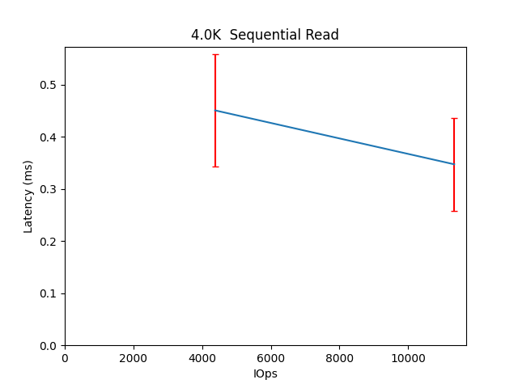
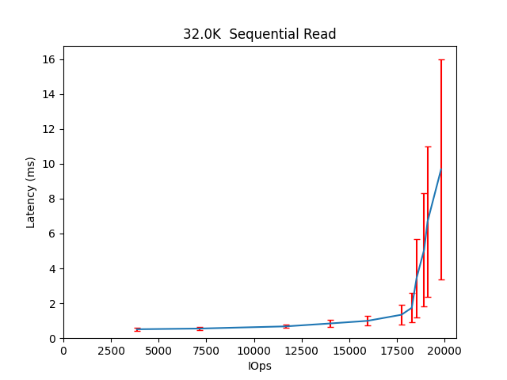
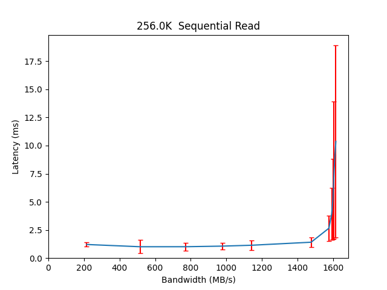
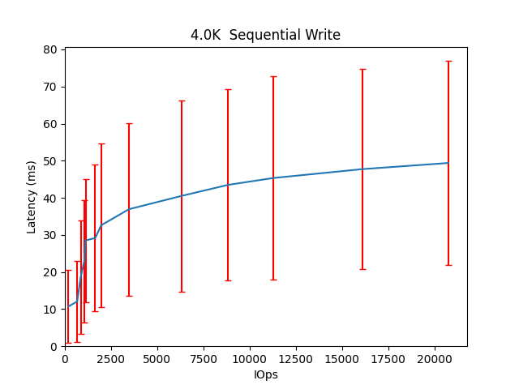
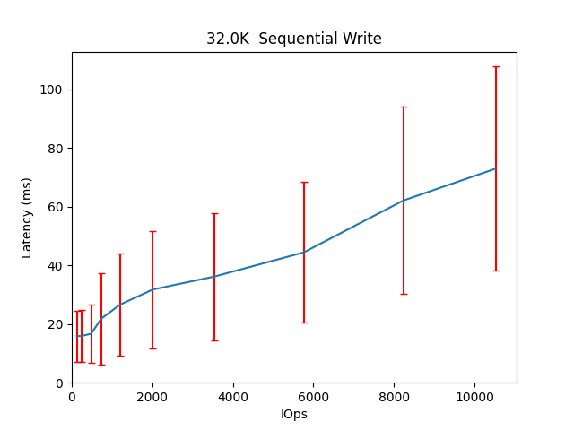
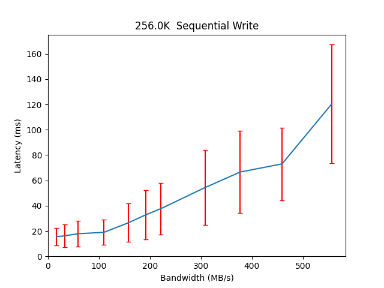

Performance Report for new-19
=============================

Table of contents
=================

* [Summary of results for new-19](#summary-of-results-for-new-19)
* [Response Curves](#response-curves)
	* [Sequential Read](#sequential-read)
	* [Sequential Write](#sequential-write)
* [Configuration yaml](#configuration-yaml)

# Summary of results for new-19
  
|Workload Name|Maximum Throughput|Latency (ms)|  
| :--- | ---: | ---: |  
|[4096_read](#4096-read)|11343 IOps|0.3|  
|[32768_read](#32768-read)|19818 IOps|9.7|  
|[262144_read](#262144-read)|1615 MB/s|10.4|  
|[4096_write](#4096-write)|20741 IOps|49.4|  
|[32768_write](#32768-write)|10524 IOps|72.9|  
|[262144_write](#262144-write)|557 MB/s|120.5|
# Response Curves

## Sequential Read

|||
| :---: | :---: |
|<a name="4096-read"></a>|<a name="32768-read"></a>|
|<a name="262144-read"></a>||

## Sequential Write

|||
| :---: | :---: |
|<a name="4096-write"></a>|<a name="32768-write"></a>|
|<a name="262144-write"></a>||

# Configuration yaml


```benchmarks:
  librbdfio:
    cmd_path: /usr/local/bin/fio
    fio_out_format: json
    log_avg_msec: 100
    log_bw: true
    log_iops: true
    log_lat: true
    norandommap: true
    osd_ra:
    - 4096
    poolname: rbd_replicated
    prefill:
      blocksize: 64k
      numjobs: 1
    procs_per_volume:
    - 1
    ramp: 30
    rbdname: cbt-librbdfio
    time: 90
    time_based: true
    use_existing_volumes: true
    vol_size: 52500
    volumes_per_client:
    - 8
    workloads:
      16k7030:
        jobname: randmix
        mode: randrw
        numjobs:
        - 1
        op_size: 16384
        rwmixread: 70
        total_iodepth:
        - 1
        - 2
        - 3
        - 4
        - 8
        - 16
        - 24
        - 32
        - 64
        - 128
        - 256
      16krandomread:
        jobname: randread
        mode: randread
        numjobs:
        - 1
        op_size: 16384
        total_iodepth:
        - 4
        - 8
        - 12
        - 16
        - 24
        - 48
        - 64
        - 128
        - 256
        - 384
      16krandomwrite:
        jobname: randwrite
        mode: randwrite
        numjobs:
        - 1
        op_size: 16384
        total_iodepth:
        - 1
        - 2
        - 3
        - 4
        - 8
        - 16
        - 32
        - 64
        - 128
        - 256
        - 384
        - 512
      1Mrandomread:
        jobname: randread
        mode: randread
        numjobs:
        - 1
        op_size: 1048576
        total_iodepth:
        - 1
        - 2
        - 3
        - 4
        - 8
        - 12
        - 16
        - 20
        - 24
        - 28
        - 32
      1Mrandomwrite:
        jobname: randwrite
        mode: randwrite
        numjobs:
        - 1
        op_size: 1048576
        total_iodepth:
        - 1
        - 2
        - 3
        - 4
        - 5
        - 6
        - 8
        - 16
        - 24
        - 32
        - 48
      1Mseqread:
        jobname: seqread
        mode: read
        numjobs:
        - 1
        op_size: 1048576
        total_iodepth:
        - 1
        - 2
        - 3
        - 4
        - 6
        - 8
        - 10
        - 12
        - 14
        - 16
        - 20
      1Mseqwrite:
        jobname: seqwrite
        mode: write
        numjobs:
        - 1
        op_size: 1048576
        total_iodepth:
        - 2
        - 4
        - 6
        - 8
        - 16
        - 32
        - 48
        - 64
        - 96
        - 128
        - 160
      256krandomread:
        jobname: randread
        mode: randread
        numjobs:
        - 1
        op_size: 262144
        total_iodepth:
        - 1
        - 2
        - 3
        - 4
        - 5
        - 8
        - 16
        - 24
        - 32
        - 64
        - 128
      256krandomwrite:
        jobname: randwrite
        mode: randwrite
        numjobs:
        - 1
        op_size: 262144
        total_iodepth:
        - 1
        - 2
        - 3
        - 4
        - 5
        - 8
        - 16
        - 32
        - 64
        - 96
        - 128
        - 256
      32krandomread:
        jobname: randread
        mode: randread
        numjobs:
        - 1
        op_size: 32768
        total_iodepth:
        - 2
        - 4
        - 6
        - 8
        - 12
        - 16
        - 24
        - 32
        - 64
        - 128
        - 256
      32krandomwrite:
        jobname: randwrite
        mode: randwrite
        numjobs:
        - 1
        op_size: 32768
        total_iodepth:
        - 1
        - 2
        - 3
        - 4
        - 8
        - 16
        - 32
        - 64
        - 128
        - 256
        - 384
        - 512
      4k7030:
        jobname: randmix
        mode: randrw
        numjobs:
        - 1
        op_size: 4096
        rwmixread: 70
        total_iodepth:
        - 1
        - 2
        - 3
        - 4
        - 8
        - 16
        - 24
        - 32
        - 64
        - 128
        - 256
      4krandomread:
        jobname: randread
        mode: randread
        numjobs:
        - 1
        op_size: 4096
        total_iodepth:
        - 4
        - 8
        - 12
        - 16
        - 32
        - 48
        - 64
        - 128
        - 256
        - 384
      4krandomwrite:
        jobname: randwrite
        mode: randwrite
        numjobs:
        - 1
        op_size: 4096
        total_iodepth:
        - 2
        - 4
        - 8
        - 16
        - 32
        - 64
        - 128
        - 256
        - 384
        - 512
        - 768
      512krandomread:
        jobname: randread
        mode: randread
        numjobs:
        - 1
        op_size: 524288
        total_iodepth:
        - 1
        - 2
        - 3
        - 4
        - 8
        - 16
        - 24
        - 32
        - 40
        - 48
        - 64
      512krandomwrite:
        jobname: randwrite
        mode: randwrite
        numjobs:
        - 1
        op_size: 524288
        total_iodepth:
        - 1
        - 2
        - 3
        - 4
        - 5
        - 6
        - 8
        - 16
        - 24
        - 32
        - 48
        - 64
      512kseqread:
        jobname: seqread
        mode: read
        numjobs:
        - 1
        op_size: 524288
        total_iodepth:
        - 1
        - 2
        - 3
        - 4
        - 6
        - 8
        - 12
        - 16
        - 20
        - 24
        - 32
      512kseqwrite:
        jobname: seqwrite
        mode: write
        numjobs:
        - 1
        op_size: 524288
        total_iodepth:
        - 1
        - 2
        - 4
        - 6
        - 8
        - 16
        - 32
        - 48
        - 64
        - 96
        - 128
      64k3070:
        jobname: randmix
        mode: randrw
        numjobs:
        - 1
        op_size: 65536
        rwmixread: 30
        total_iodepth:
        - 1
        - 2
        - 3
        - 4
        - 8
        - 16
        - 32
        - 64
        - 96
        - 128
        - 256
      64k7030:
        jobname: randmix
        mode: randrw
        numjobs:
        - 1
        op_size: 65536
        rwmixread: 70
        total_iodepth:
        - 1
        - 2
        - 3
        - 4
        - 8
        - 16
        - 32
        - 64
        - 96
        - 128
        - 256
      64krandomread:
        jobname: randread
        mode: randread
        numjobs:
        - 1
        op_size: 65536
        total_iodepth:
        - 2
        - 4
        - 6
        - 8
        - 12
        - 16
        - 24
        - 32
        - 64
        - 128
        - 256
      64krandomwrite:
        jobname: randwrite
        mode: randwrite
        numjobs:
        - 1
        op_size: 65536
        total_iodepth:
        - 2
        - 4
        - 6
        - 8
        - 16
        - 24
        - 32
        - 64
        - 128
        - 256
        - 384
      64kseqread:
        jobname: read
        mode: read
        numjobs:
        - 1
        op_size: 65536
        total_iodepth:
        - 2
        - 4
        - 6
        - 8
        - 16
        - 24
        - 32
        - 64
        - 128
        - 192
        - 256
      64kseqwrite:
        jobname: write
        mode: write
        numjobs:
        - 1
        op_size: 65536
        total_iodepth:
        - 4
        - 8
        - 12
        - 16
        - 32
        - 48
        - 64
        - 128
        - 256
        - 384
        - 512
      8krandomread:
        jobname: randread
        mode: randread
        numjobs:
        - 1
        op_size: 8192
        total_iodepth:
        - 4
        - 8
        - 12
        - 16
        - 32
        - 48
        - 64
        - 128
        - 256
        - 384
      8krandomwrite:
        jobname: randwrite
        mode: randwrite
        numjobs:
        - 1
        op_size: 8192
        total_iodepth:
        - 2
        - 4
        - 8
        - 16
        - 32
        - 64
        - 128
        - 256
        - 384
        - 512
        - 768
      precondition:
        jobname: precond1rw
        mode: randwrite
        monitor: false
        numjobs:
        - 1
        op_size: 65536
        time: 600
        total_iodepth:
        - 16
      seq16kread:
        jobname: seqread
        mode: read
        numjobs:
        - 1
        op_size: 16384
        total_iodepth:
        - 2
        - 4
        - 8
        - 12
        - 16
        - 24
        - 32
        - 64
        - 96
        - 128
        - 192
      seq16kwrite:
        jobname: seqwrite
        mode: write
        numjobs:
        - 1
        op_size: 16384
        total_iodepth:
        - 2
        - 4
        - 8
        - 16
        - 32
        - 48
        - 64
        - 128
        - 256
        - 384
        - 512
      seq256kread:
        jobname: seqread
        mode: read
        numjobs:
        - 1
        op_size: 262144
        total_iodepth:
        - 1
        - 2
        - 3
        - 4
        - 5
        - 8
        - 16
        - 24
        - 32
        - 48
        - 64
      seq256kwrite:
        jobname: seqwrite
        mode: write
        numjobs:
        - 1
        op_size: 262144
        total_iodepth:
        - 1
        - 2
        - 4
        - 8
        - 16
        - 24
        - 32
        - 64
        - 96
        - 128
        - 256
      seq32kread:
        jobname: seqread
        mode: read
        numjobs:
        - 1
        op_size: 32768
        total_iodepth:
        - 2
        - 4
        - 8
        - 12
        - 16
        - 24
        - 32
        - 64
        - 96
        - 128
        - 192
      seq32kwrite:
        jobname: seqwrite
        mode: write
        numjobs:
        - 1
        op_size: 32768
        total_iodepth:
        - 2
        - 4
        - 8
        - 16
        - 32
        - 64
        - 128
        - 256
        - 512
        - 768
      seq4kread:
        jobname: seqread
        mode: read
        numjobs:
        - 1
        op_size: 4096
        total_iodepth:
        - 2
        - 4
        - 8
        - 12
        - 16
        - 24
        - 32
        - 64
        - 96
        - 128
        - 192
      seq4kwrite:
        jobname: seqwrite
        mode: write
        numjobs:
        - 1
        op_size: 4096
        total_iodepth:
        - 2
        - 8
        - 16
        - 24
        - 32
        - 48
        - 64
        - 128
        - 256
        - 384
        - 512
        - 768
        - 1024
      seq8kread:
        jobname: seqread
        mode: read
        numjobs:
        - 1
        op_size: 8192
        total_iodepth:
        - 2
        - 4
        - 8
        - 12
        - 16
        - 24
        - 32
        - 64
        - 96
        - 128
        - 192
      seq8kwrite:
        jobname: seqwrite
        mode: write
        numjobs:
        - 1
        op_size: 8192
        total_iodepth:
        - 2
        - 8
        - 16
        - 24
        - 32
        - 48
        - 64
        - 128
        - 256
        - 384
        - 512
        - 768
        - 1024
        - 1280
cluster:
  archive_dir: /tmp/cbt
  ceph-mgr_cmd: /usr/bin/ceph-mgr
  ceph-mon_cmd: /usr/bin/ceph-mon
  ceph-osd_cmd: /usr/bin/ceph-osd
  ceph-run_cmd: /usr/bin/ceph-run
  ceph_cmd: /usr/bin/ceph
  clients:
  - --- server1 ---
  clusterid: ceph
  conf_file: /cbt/ceph.conf.4x1x1.fs
  fs: xfs
  head: --- server1 ---
  iterations: 1
  mgrs:
    --- server1 ---:
      a: null
  mkfs_opts: -f -i size=2048
  mons:
    --- server1 ---:
      a: --- IP Address --:6789
  mount_opts: -o inode64,noatime,logbsize=256k
  osds:
  - --- server1 ---
  osds_per_node: 6
  pdsh_ssh_args: -a -x -l%u %h
  rados_cmd: /usr/bin/rados
  rbd_cmd: /usr/bin/rbd
  tmp_dir: /tmp/cbt
  use_existing: true
  user: root
monitoring_profiles:
  collectl:
    args: -c 18 -sCD -i 10 -P -oz -F0 --rawtoo --sep ";" -f {collectl_dir}
```