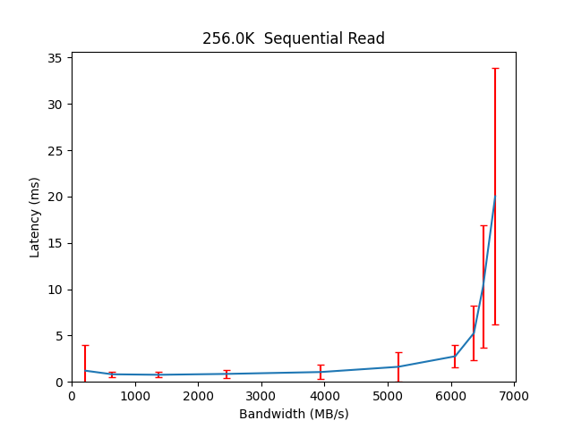
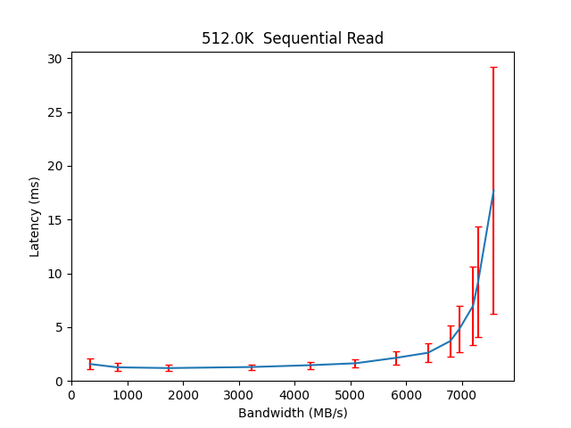
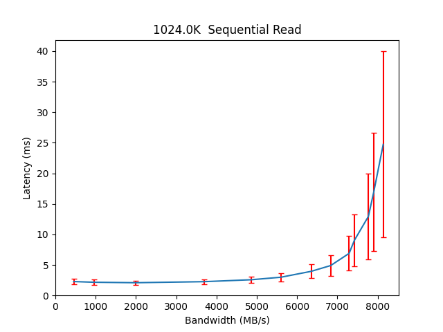

Performance Report for 22-Sep-optimised
=======================================

Table of contents
=================

* [Summary of results for 22-Sep-optimised](#summary-of-results-for-22-sep-optimised)
* [Response Curves](#response-curves)
	* [Sequential Read](#sequential-read)
* [Configuration yaml](#configuration-yaml)

# Summary of results for 22-Sep-optimised
  
|Workload Name|Maximum Throughput|Latency (ms)|  
| :--- | ---: | ---: |  
|[262144_read](#262144-read)|6700 MB/s|20.0|  
|[524288_read](#524288-read)|7571 MB/s|17.7|  
|[1048576_read](#1048576-read)|8137 MB/s|24.7|
# Response Curves

## Sequential Read

|||
| :---: | :---: |
|<a name="262144-read"></a>|<a name="524288-read"></a>|
|<a name="1048576-read"></a>||

# Configuration yaml


```benchmarks:
  librbdfio:
    cmd_path: /usr/local/bin/fio
    fio_out_format: json
    log_avg_msec: 100
    log_bw: true
    log_iops: true
    log_lat: true
    norandommap: true
    osd_ra:
    - 4096
    poolname: rbd_replicated
    prefill:
      blocksize: 64k
      numjobs: 1
    procs_per_volume:
    - 1
    ramp: 30
    rbdname: cbt-librbdfio
    time: 90
    time_based: true
    use_existing_volumes: true
    vol_size: 1204500
    volumes_per_client:
    - 16
    workloads:
      1Mseqread:
        jobname: seqread
        mode: read
        numjobs:
        - 1
        op_size: 1048576
        total_iodepth:
        - 1
        - 2
        - 4
        - 8
        - 12
        - 16
        - 24
        - 32
        - 48
        - 64
        - 96
        - 128
        - 192
      512kseqread:
        jobname: seqread
        mode: read
        numjobs:
        - 1
        op_size: 524288
        total_iodepth:
        - 1
        - 2
        - 4
        - 8
        - 12
        - 16
        - 24
        - 32
        - 48
        - 64
        - 96
        - 128
        - 256
      precondition:
        jobname: precond1rw
        mode: randwrite
        monitor: false
        numjobs:
        - 1
        op_size: 65536
        time: 600
        total_iodepth:
        - 16
      seq256kread:
        jobname: seqread
        mode: read
        numjobs:
        - 1
        op_size: 262144
        total_iodepth:
        - 1
        - 2
        - 4
        - 8
        - 16
        - 32
        - 64
        - 128
        - 256
        - 512
cluster:
  archive_dir: /tmp/cbt
  ceph-mgr_cmd: /usr/bin/ceph-mgr
  ceph-mon_cmd: /usr/bin/ceph-mon
  ceph-osd_cmd: /usr/bin/ceph-osd
  ceph-run_cmd: /usr/bin/ceph-run
  ceph_cmd: /usr/bin/ceph
  clients:
  - --- server1 ---
  clusterid: ceph
  conf_file: /cbt/ceph.conf.4x1x1.fs
  fs: xfs
  head: --- server1 ---
  iterations: 1
  mgrs:
    --- server1 ---:
      a: null
  mkfs_opts: -f -i size=2048
  mons:
    --- server1 ---:
      a: --- IP Address --:6789
  mount_opts: -o inode64,noatime,logbsize=256k
  osds:
  - --- server1 ---
  osds_per_node: 8
  pdsh_ssh_args: -a -x -l%u %h
  rados_cmd: /usr/bin/rados
  rbd_cmd: /usr/bin/rbd
  tmp_dir: /tmp/cbt
  use_existing: true
  user: ljsanders
monitoring_profiles:
  collectl:
    args: -c 18 -sCD -i 10 -P -oz -F0 --rawtoo --sep ";" -f {collectl_dir}
```