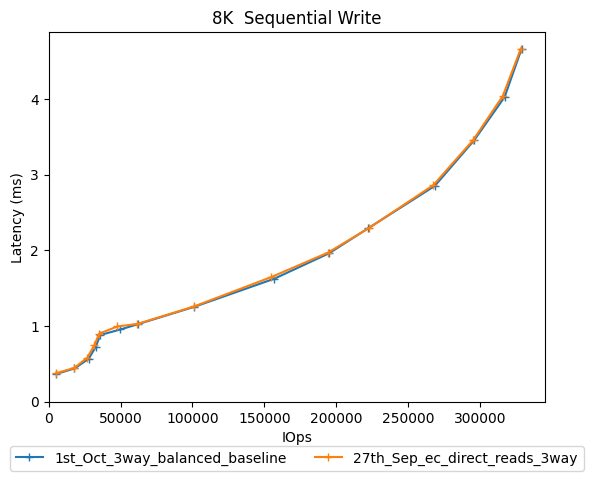
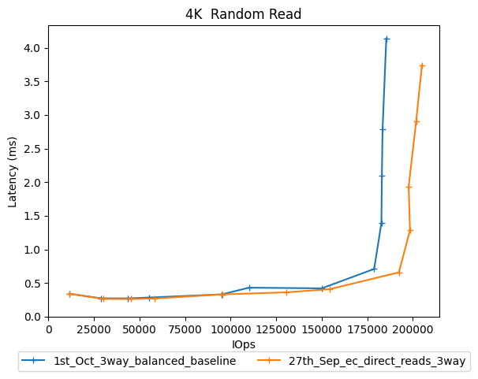

Comparitive Performance Report for 1st-Oct-3way-balanced-baseline vs 27th-Sep-ec-direct-reads-3way
==================================================================================================

Table of contents
=================

* [Comparison summary for 1st-Oct-3way-balanced-baseline vs 27th-Sep-ec-direct-reads-3way](#comparison-summary-for-1st-oct-3way-balanced-baseline-vs-27th-sep-ec-direct-reads-3way)
* [Response Curves](#response-curves)
	* [Sequential Read](#sequential-read)
	* [Sequential Write](#sequential-write)
	* [Random Read](#random-read)
	* [Random Write](#random-write)
	* [Random Read/Write](#random-readwrite)
* [Configuration yaml files](#configuration-yaml-files)
	* [results](#results)
	* [results](#results)

# Comparison summary for 1st-Oct-3way-balanced-baseline vs 27th-Sep-ec-direct-reads-3way
  
|Sequential Read|1st_Oct_3way_balanced_baseline|27th_Sep_ec_direct_reads_3way|%change throughput|%change latency|  
| :--- | ---: | ---: | ---: | ---: |  
|[4K](#4096-read)|138070 IOps@0.7ms|220836 IOps@1.7ms|60%|143%|  
|[8K](#8192-read)|125045 IOps@0.8ms|210231 IOps@1.8ms|68%|125%|  
|[16K](#16384-read)|111570 IOps@2.6ms|191084 IOps@1.5ms|71%|-42%|  
|[32K](#32768-read)|91239 IOps@2.8ms|147245 IOps@1.3ms|61%|-54%|  
|[64K](#65536-read)|4871 MB/s@5.2ms|7625 MB/s@2.2ms|57%|-58%|  
|[256K](#262144-read)|12045 MB/s@16.7ms|11156 MB/s@12.0ms|-7%|-28%|  
|[512K](#524288-read)|12733 MB/s@15.8ms|11982 MB/s@11.2ms|-6%|-29%|  
|[1024K](#1048576-read)|12089 MB/s@8.3ms|12551 MB/s@5.3ms|4%|-36%|  
  
|Sequential Write|1st_Oct_3way_balanced_baseline|27th_Sep_ec_direct_reads_3way|%change throughput|%change latency|  
| :--- | ---: | ---: | ---: | ---: |  
|[4K](#4096-write)|492507 IOps@3.1ms|496157 IOps@3.1ms|1%|0%|  
|[8K](#8192-write)|328957 IOps@4.7ms|328509 IOps@4.7ms|-0%|0%|  
|[16K](#16384-write)|181650 IOps@5.6ms|181537 IOps@5.6ms|-0%|0%|  
|[32K](#32768-write)|101798 IOps@7.5ms|99713 IOps@7.7ms|-2%|3%|  
|[64K](#65536-write)|3483 MB/s@9.6ms|3422 MB/s@9.8ms|-2%|2%|  
|[256K](#262144-write)|3924 MB/s@17.0ms|3853 MB/s@17.3ms|-2%|2%|  
|[512K](#524288-write)|4009 MB/s@4.0ms|3982 MB/s@8.2ms|-1%|105%|  
|[1024K](#1048576-write)|4015 MB/s@41.2ms|4071 MB/s@32.4ms|1%|-21%|  
  
|Random Read|1st_Oct_3way_balanced_baseline|27th_Sep_ec_direct_reads_3way|%change throughput|%change latency|  
| :--- | ---: | ---: | ---: | ---: |  
|[4K](#4096-randread)|185438 IOps@4.1ms|204999 IOps@3.7ms|11%|-10%|  
|[8K](#8192-randread)|178815 IOps@4.3ms|196145 IOps@3.9ms|10%|-9%|  
|[16K](#16384-randread)|164000 IOps@3.6ms|180473 IOps@3.3ms|10%|-8%|  
|[32K](#32768-randread)|134280 IOps@2.9ms|152053 IOps@3.4ms|13%|17%|  
|[64K](#65536-randread)|6881 MB/s@3.7ms|7786 MB/s@3.2ms|13%|-14%|  
|[256K](#262144-randread)|12833 MB/s@5.2ms|11532 MB/s@2.9ms|-10%|-44%|  
|[512K](#524288-randread)|12833 MB/s@3.9ms|11996 MB/s@2.8ms|-7%|-28%|  
|[1024K](#1048576-randread)|12053 MB/s@5.6ms|12190 MB/s@2.7ms|1%|-52%|  
  
|Random Write|1st_Oct_3way_balanced_baseline|27th_Sep_ec_direct_reads_3way|%change throughput|%change latency|  
| :--- | ---: | ---: | ---: | ---: |  
|[4K](#4096-randwrite)|49783 IOps@5.1ms|49410 IOps@5.2ms|-1%|2%|  
|[8K](#8192-randwrite)|47446 IOps@5.4ms|46732 IOps@8.2ms|-2%|52%|  
|[16K](#16384-randwrite)|46475 IOps@8.2ms|44616 IOps@8.6ms|-4%|5%|  
|[32K](#32768-randwrite)|43324 IOps@8.8ms|41611 IOps@9.2ms|-4%|5%|  
|[64K](#65536-randwrite)|2370 MB/s@10.6ms|2242 MB/s@11.2ms|-5%|6%|  
|[256K](#262144-randwrite)|4054 MB/s@16.4ms|3910 MB/s@6.3ms|-4%|-62%|  
|[512K](#524288-randwrite)|4531 MB/s@7.1ms|4384 MB/s@7.4ms|-3%|4%|  
|[1024K](#1048576-randwrite)|4142 MB/s@5.6ms|4123 MB/s@7.7ms|-0%|38%|  
  
  
|Random Read/Write|1st_Oct_3way_balanced_baseline|27th_Sep_ec_direct_reads_3way|%change throughput|%change latency|  
| :--- | ---: | ---: | ---: | ---: |  
|[4K_70/30 ](#4096-70-30-randrw)|98855 IOps@2.6ms|90173 IOps@2.8ms|-9%|8%|  
|[16K_70/30 ](#16384-70-30-randrw)|89858 IOps@2.8ms|85207 IOps@3.0ms|-5%|7%|  
|[64K_30/70 ](#65536-30-70-randrw)|2960 MB/s@5.6ms|2745 MB/s@6.1ms|-7%|9%|  
|[64K_70/30 ](#65536-70-30-randrw)|4284 MB/s@3.9ms|4204 MB/s@4.0ms|-2%|3%|  

# Response Curves

## Sequential Read

|||
| :---: | :---: |
|<a name="4096-read"></a>|<a name="8192-read"></a>|
|<a name="16384-read"></a>|<a name="32768-read"></a>|
|<a name="65536-read"></a>|<a name="262144-read"></a>|
|<a name="524288-read"></a>|<a name="1048576-read"></a>|

## Sequential Write

|||
| :---: | :---: |
|<a name="4096-write"></a>|<a name="8192-write"></a>|
|<a name="16384-write"></a>|<a name="32768-write"></a>|
|<a name="65536-write"></a>|<a name="262144-write"></a>|
|<a name="524288-write"></a>|<a name="1048576-write"></a>|

## Random Read

|||
| :---: | :---: |
|<a name="4096-randread"></a>|<a name="8192-randread"></a>|
|<a name="16384-randread"></a>|<a name="32768-randread"></a>|
|<a name="65536-randread"></a>|<a name="262144-randread"></a>|
|<a name="524288-randread"></a>|<a name="1048576-randread"></a>|

## Random Write

|||
| :---: | :---: |
|<a name="4096-randwrite"></a>|<a name="8192-randwrite"></a>|
|<a name="16384-randwrite"></a>|<a name="32768-randwrite"></a>|
|<a name="65536-randwrite"></a>|<a name="262144-randwrite"></a>|
|<a name="524288-randwrite"></a>|<a name="1048576-randwrite"></a>|

## Random Read/Write

|||
| :---: | :---: |
|<a name="4096-70-30-randrw"></a>|<a name="16384-70-30-randrw"></a>|
|<a name="65536-30-70-randrw"></a>|<a name="65536-70-30-randrw"></a>|

# Configuration yaml files


Only yaml files that differ by more than 20 lines from the yaml file for the baseline directory will be added here in addition to the baseline yaml  

## results


```benchmarks:
  librbdfio:
    cmd_path: /usr/local/bin/fio
    fio_out_format: json
    log_avg_msec: 100
    log_bw: true
    log_iops: true
    log_lat: true
    norandommap: true
    osd_ra:
    - 4096
    poolname: rbd_replicated
    prefill:
      blocksize: 64k
      numjobs: 1
    procs_per_volume:
    - 1
    ramp: 30
    rbdname: cbt-librbdfio
    time: 90
    time_based: true
    use_existing_volumes: true
    vol_size: 608333
    volumes_per_client:
    - 16
    workloads:
      128krandomread:
        jobname: randread
        mode: randread
        numjobs:
        - 1
        op_size: 131072
        total_iodepth:
        - 4
        - 8
        - 12
        - 16
        - 32
        - 48
        - 64
        - 128
        - 256
        - 384
      16k7030:
        jobname: randmix
        mode: randrw
        numjobs:
        - 1
        op_size: 16384
        rwmixread: 70
        total_iodepth:
        - 1
        - 2
        - 3
        - 4
        - 8
        - 16
        - 24
        - 32
        - 64
        - 128
        - 256
      16krandomread:
        jobname: randread
        mode: randread
        numjobs:
        - 1
        op_size: 16384
        total_iodepth:
        - 4
        - 8
        - 12
        - 16
        - 24
        - 48
        - 64
        - 128
        - 256
        - 384
        - 588
      16krandomwrite:
        jobname: randwrite
        mode: randwrite
        numjobs:
        - 1
        op_size: 16384
        total_iodepth:
        - 1
        - 2
        - 3
        - 4
        - 8
        - 16
        - 32
        - 64
        - 128
        - 256
        - 384
        - 512
      1Mrandomread:
        jobname: randread
        mode: randread
        numjobs:
        - 1
        op_size: 1048576
        total_iodepth:
        - 1
        - 2
        - 3
        - 4
        - 8
        - 12
        - 16
        - 20
        - 24
        - 28
        - 32
        - 48
        - 64
        - 96
        - 128
      1Mrandomwrite:
        jobname: randwrite
        mode: randwrite
        numjobs:
        - 1
        op_size: 1048576
        total_iodepth:
        - 1
        - 2
        - 3
        - 4
        - 5
        - 6
        - 8
        - 16
        - 24
        - 32
        - 48
      1Mseqread:
        jobname: seqread
        mode: read
        numjobs:
        - 1
        op_size: 1048576
        total_iodepth:
        - 1
        - 2
        - 4
        - 8
        - 12
        - 16
        - 24
        - 32
        - 48
        - 64
        - 96
        - 128
        - 192
        - 256
      1Mseqwrite:
        jobname: seqwrite
        mode: write
        numjobs:
        - 1
        op_size: 1048576
        total_iodepth:
        - 2
        - 4
        - 6
        - 8
        - 16
        - 32
        - 48
        - 64
        - 96
        - 128
        - 160
      256krandomread:
        jobname: randread
        mode: randread
        numjobs:
        - 1
        op_size: 262144
        total_iodepth:
        - 1
        - 2
        - 3
        - 4
        - 5
        - 8
        - 16
        - 24
        - 32
        - 64
        - 128
        - 192
        - 256
      256krandomwrite:
        jobname: randwrite
        mode: randwrite
        numjobs:
        - 1
        op_size: 262144
        total_iodepth:
        - 1
        - 2
        - 3
        - 4
        - 5
        - 8
        - 16
        - 32
        - 64
        - 96
        - 128
        - 256
      2Mrandomread:
        jobname: randread
        mode: randread
        numjobs:
        - 1
        op_size: 2097152
        total_iodepth:
        - 4
        - 8
        - 12
        - 16
        - 32
        - 48
        - 64
        - 96
      2Mseqread:
        jobname: seqread
        mode: read
        numjobs:
        - 1
        op_size: 2097152
        total_iodepth:
        - 1
        - 2
        - 4
        - 8
        - 12
        - 16
        - 24
        - 32
        - 48
        - 64
        - 96
        - 128
      2Mseqwrite:
        jobname: seqwrite
        mode: write
        numjobs:
        - 1
        op_size: 2097152
        total_iodepth:
        - 1
        - 2
        - 4
        - 6
        - 8
        - 16
        - 32
        - 48
        - 64
      32krandomread:
        jobname: randread
        mode: randread
        numjobs:
        - 1
        op_size: 32768
        total_iodepth:
        - 2
        - 4
        - 6
        - 8
        - 12
        - 16
        - 24
        - 32
        - 64
        - 128
        - 256
        - 384
        - 512
      32krandomwrite:
        jobname: randwrite
        mode: randwrite
        numjobs:
        - 1
        op_size: 32768
        total_iodepth:
        - 1
        - 2
        - 3
        - 4
        - 8
        - 16
        - 32
        - 64
        - 128
        - 256
        - 384
        - 512
      384krandomread:
        jobname: randread
        mode: randread
        numjobs:
        - 1
        op_size: 393216
        total_iodepth:
        - 4
        - 8
        - 12
        - 16
        - 32
        - 48
        - 64
        - 128
        - 256
      4Mrandomread:
        jobname: randread
        mode: randread
        numjobs:
        - 1
        op_size: 4194304
        total_iodepth:
        - 4
        - 8
        - 12
        - 16
        - 32
        - 48
        - 64
        - 96
      4Mseqread:
        jobname: seqread
        mode: read
        numjobs:
        - 1
        op_size: 4194304
        total_iodepth:
        - 1
        - 2
        - 4
        - 8
        - 12
        - 16
        - 24
        - 32
        - 48
        - 64
      4Mseqwrite:
        jobname: seqwrite
        mode: write
        numjobs:
        - 1
        op_size: 4194304
        total_iodepth:
        - 1
        - 2
        - 4
        - 6
        - 8
        - 16
        - 32
      4k7030:
        jobname: randmix
        mode: randrw
        numjobs:
        - 1
        op_size: 4096
        rwmixread: 70
        total_iodepth:
        - 1
        - 2
        - 3
        - 4
        - 8
        - 16
        - 24
        - 32
        - 64
        - 128
        - 256
        - 384
      4krandomread:
        jobname: randread
        mode: randread
        numjobs:
        - 1
        op_size: 4096
        total_iodepth:
        - 4
        - 8
        - 12
        - 16
        - 32
        - 48
        - 64
        - 128
        - 256
        - 384
        - 512
        - 768
      4krandomwrite:
        jobname: randwrite
        mode: randwrite
        numjobs:
        - 1
        op_size: 4096
        total_iodepth:
        - 2
        - 4
        - 8
        - 16
        - 32
        - 64
        - 128
        - 256
        - 384
        - 512
        - 768
      512krandomread:
        jobname: randread
        mode: randread
        numjobs:
        - 1
        op_size: 524288
        total_iodepth:
        - 1
        - 2
        - 3
        - 4
        - 8
        - 16
        - 24
        - 32
        - 40
        - 48
        - 64
        - 96
        - 128
        - 192
        - 256
      512krandomwrite:
        jobname: randwrite
        mode: randwrite
        numjobs:
        - 1
        op_size: 524288
        total_iodepth:
        - 1
        - 2
        - 3
        - 4
        - 5
        - 6
        - 8
        - 16
        - 24
        - 32
        - 48
        - 64
      512kseqread:
        jobname: seqread
        mode: read
        numjobs:
        - 1
        op_size: 524288
        total_iodepth:
        - 1
        - 2
        - 4
        - 8
        - 12
        - 16
        - 24
        - 32
        - 48
        - 64
        - 96
        - 128
        - 192
        - 256
        - 384
      512kseqwrite:
        jobname: seqwrite
        mode: write
        numjobs:
        - 1
        op_size: 524288
        total_iodepth:
        - 1
        - 2
        - 4
        - 6
        - 8
        - 16
        - 32
        - 48
        - 64
        - 96
        - 128
      64k3070:
        jobname: randmix
        mode: randrw
        numjobs:
        - 1
        op_size: 65536
        rwmixread: 30
        total_iodepth:
        - 1
        - 2
        - 3
        - 4
        - 8
        - 16
        - 32
        - 64
        - 96
        - 128
        - 256
      64k7030:
        jobname: randmix
        mode: randrw
        numjobs:
        - 1
        op_size: 65536
        rwmixread: 70
        total_iodepth:
        - 1
        - 2
        - 3
        - 4
        - 8
        - 16
        - 32
        - 64
        - 96
        - 128
        - 256
      64krandomread:
        jobname: randread
        mode: randread
        numjobs:
        - 1
        op_size: 65536
        total_iodepth:
        - 2
        - 4
        - 6
        - 8
        - 12
        - 16
        - 24
        - 32
        - 64
        - 128
        - 256
        - 384
      64krandomwrite:
        jobname: randwrite
        mode: randwrite
        numjobs:
        - 1
        op_size: 65536
        total_iodepth:
        - 2
        - 4
        - 6
        - 8
        - 16
        - 24
        - 32
        - 64
        - 128
        - 256
        - 384
      64kseqread:
        jobname: seqread
        mode: read
        numjobs:
        - 1
        op_size: 65536
        total_iodepth:
        - 2
        - 4
        - 6
        - 8
        - 16
        - 24
        - 32
        - 64
        - 128
        - 192
        - 256
        - 384
      64kseqwrite:
        jobname: seqwrite
        mode: write
        numjobs:
        - 1
        op_size: 65536
        total_iodepth:
        - 4
        - 8
        - 12
        - 16
        - 32
        - 48
        - 64
        - 128
        - 256
        - 384
        - 512
      768krandomread:
        jobname: randread
        mode: randread
        numjobs:
        - 1
        op_size: 786432
        total_iodepth:
        - 4
        - 8
        - 12
        - 16
        - 32
        - 48
        - 64
        - 128
        - 192
      8krandomread:
        jobname: randread
        mode: randread
        numjobs:
        - 1
        op_size: 8192
        total_iodepth:
        - 4
        - 8
        - 12
        - 16
        - 32
        - 48
        - 64
        - 128
        - 256
        - 384
        - 588
        - 768
      8krandomwrite:
        jobname: randwrite
        mode: randwrite
        numjobs:
        - 1
        op_size: 8192
        total_iodepth:
        - 2
        - 4
        - 8
        - 16
        - 32
        - 64
        - 128
        - 256
        - 384
        - 512
        - 768
      precondition:
        jobname: precond1rw
        mode: randwrite
        monitor: false
        numjobs:
        - 1
        op_size: 65536
        time: 600
        total_iodepth:
        - 16
      seq128kread:
        jobname: seqread
        mode: read
        numjobs:
        - 1
        op_size: 131072
        total_iodepth:
        - 1
        - 2
        - 4
        - 8
        - 16
        - 32
        - 64
        - 128
        - 256
        - 512
      seq128kwrite:
        jobname: seqwrite
        mode: write
        numjobs:
        - 1
        op_size: 131072
        total_iodepth:
        - 1
        - 2
        - 4
        - 6
        - 8
        - 16
        - 32
        - 48
        - 64
        - 96
        - 128
        - 256
        - 384
      seq16kread:
        jobname: seqread
        mode: read
        numjobs:
        - 1
        op_size: 16384
        total_iodepth:
        - 2
        - 4
        - 8
        - 12
        - 16
        - 24
        - 32
        - 64
        - 96
        - 128
        - 192
        - 288
      seq16kwrite:
        jobname: seqwrite
        mode: write
        numjobs:
        - 1
        op_size: 16384
        total_iodepth:
        - 2
        - 4
        - 8
        - 16
        - 32
        - 48
        - 64
        - 128
        - 256
        - 384
        - 512
        - 768
        - 1024
      seq256kread:
        jobname: seqread
        mode: read
        numjobs:
        - 1
        op_size: 262144
        total_iodepth:
        - 1
        - 2
        - 4
        - 8
        - 16
        - 32
        - 64
        - 128
        - 256
        - 512
        - 768
      seq256kwrite:
        jobname: seqwrite
        mode: write
        numjobs:
        - 1
        op_size: 262144
        total_iodepth:
        - 1
        - 2
        - 4
        - 8
        - 16
        - 24
        - 32
        - 64
        - 96
        - 128
        - 256
      seq32kread:
        jobname: seqread
        mode: read
        numjobs:
        - 1
        op_size: 32768
        total_iodepth:
        - 2
        - 4
        - 8
        - 12
        - 16
        - 24
        - 32
        - 64
        - 96
        - 128
        - 192
        - 256
      seq32kwrite:
        jobname: seqwrite
        mode: write
        numjobs:
        - 1
        op_size: 32768
        total_iodepth:
        - 2
        - 4
        - 8
        - 16
        - 32
        - 64
        - 128
        - 256
        - 512
        - 768
      seq384kread:
        jobname: seqread
        mode: read
        numjobs:
        - 1
        op_size: 393216
        total_iodepth:
        - 1
        - 2
        - 4
        - 8
        - 16
        - 32
        - 64
        - 128
        - 192
      seq384kwrite:
        jobname: seqwrite
        mode: write
        numjobs:
        - 1
        op_size: 393216
        total_iodepth:
        - 1
        - 2
        - 4
        - 6
        - 8
        - 16
        - 32
        - 48
        - 64
        - 96
        - 128
        - 256
        - 512
      seq4kread:
        jobname: seqread
        mode: read
        numjobs:
        - 1
        op_size: 4096
        total_iodepth:
        - 2
        - 4
        - 8
        - 12
        - 16
        - 24
        - 32
        - 64
        - 96
        - 128
        - 192
        - 288
        - 384
      seq4kwrite:
        jobname: seqwrite
        mode: write
        numjobs:
        - 1
        op_size: 4096
        total_iodepth:
        - 2
        - 8
        - 16
        - 24
        - 32
        - 48
        - 64
        - 128
        - 256
        - 384
        - 512
        - 768
        - 1024
        - 1280
        - 1536
      seq768kread:
        jobname: seqread
        mode: read
        numjobs:
        - 1
        op_size: 786432
        total_iodepth:
        - 1
        - 2
        - 4
        - 8
        - 12
        - 16
        - 24
        - 32
        - 48
        - 64
        - 96
        - 128
        - 192
        - 256
        - 384
      seq768kwrite:
        jobname: seqwrite
        mode: write
        numjobs:
        - 1
        op_size: 786432
        total_iodepth:
        - 1
        - 2
        - 4
        - 6
        - 8
        - 16
        - 32
        - 48
        - 64
        - 96
        - 128
      seq8kread:
        jobname: seqread
        mode: read
        numjobs:
        - 1
        op_size: 8192
        total_iodepth:
        - 2
        - 4
        - 8
        - 12
        - 16
        - 24
        - 32
        - 64
        - 96
        - 128
        - 192
        - 288
        - 384
      seq8kwrite:
        jobname: seqwrite
        mode: write
        numjobs:
        - 1
        op_size: 8192
        total_iodepth:
        - 2
        - 8
        - 16
        - 24
        - 32
        - 48
        - 64
        - 128
        - 256
        - 384
        - 512
        - 768
        - 1024
        - 1280
        - 1536
cluster:
  archive_dir: /tmp/cbt
  ceph-mgr_cmd: /usr/bin/ceph-mgr
  ceph-mon_cmd: /usr/bin/ceph-mon
  ceph-osd_cmd: /usr/bin/ceph-osd
  ceph-run_cmd: /usr/bin/ceph-run
  ceph_cmd: /usr/bin/ceph
  clients:
  - --- server1 ---
  clusterid: ceph
  conf_file: /cbt/ceph.conf.4x1x1.fs
  fs: xfs
  head: --- server1 ---
  iterations: 1
  mgrs:
    --- server1 ---:
      a: null
  mkfs_opts: -f -i size=2048
  mons:
    --- server1 ---:
      a: --- IP Address --:6789
  mount_opts: -o inode64,noatime,logbsize=256k
  osds:
  - --- server1 ---
  osds_per_node: 8
  pdsh_ssh_args: -a -x -l%u %h
  rados_cmd: /usr/bin/rados
  rbd_cmd: /usr/bin/rbd
  tmp_dir: /tmp/cbt
  use_existing: true
  user: ljsanders
monitoring_profiles:
  collectl:
    args: -c 18 -sCD -i 10 -P -oz -F0 --rawtoo --sep ";" -f {collectl_dir}
```

```benchmarks:
  librbdfio:
    cmd_path: /usr/local/bin/fio
    fio_out_format: json
    log_avg_msec: 100
    log_bw: true
    log_iops: true
    log_lat: true
    norandommap: true
    osd_ra:
    - 4096
    poolname: rbd_replicated
    prefill:
      blocksize: 64k
      numjobs: 1
    procs_per_volume:
    - 1
    ramp: 30
    rbdname: cbt-librbdfio
    time: 90
    time_based: true
    use_existing_volumes: true
    vol_size: 608333
    volumes_per_client:
    - 16
    workloads:
      128krandomread:
        jobname: randread
        mode: randread
        numjobs:
        - 1
        op_size: 131072
        total_iodepth:
        - 4
        - 8
        - 12
        - 16
        - 32
        - 48
        - 64
        - 128
        - 256
        - 384
      16k7030:
        jobname: randmix
        mode: randrw
        numjobs:
        - 1
        op_size: 16384
        rwmixread: 70
        total_iodepth:
        - 1
        - 2
        - 3
        - 4
        - 8
        - 16
        - 24
        - 32
        - 64
        - 128
        - 256
      16krandomread:
        jobname: randread
        mode: randread
        numjobs:
        - 1
        op_size: 16384
        total_iodepth:
        - 4
        - 8
        - 12
        - 16
        - 24
        - 48
        - 64
        - 128
        - 256
        - 384
        - 588
      16krandomwrite:
        jobname: randwrite
        mode: randwrite
        numjobs:
        - 1
        op_size: 16384
        total_iodepth:
        - 1
        - 2
        - 3
        - 4
        - 8
        - 16
        - 32
        - 64
        - 128
        - 256
        - 384
        - 512
      1Mrandomread:
        jobname: randread
        mode: randread
        numjobs:
        - 1
        op_size: 1048576
        total_iodepth:
        - 1
        - 2
        - 3
        - 4
        - 8
        - 12
        - 16
        - 20
        - 24
        - 28
        - 32
        - 48
        - 64
        - 96
        - 128
      1Mrandomwrite:
        jobname: randwrite
        mode: randwrite
        numjobs:
        - 1
        op_size: 1048576
        total_iodepth:
        - 1
        - 2
        - 3
        - 4
        - 5
        - 6
        - 8
        - 16
        - 24
        - 32
        - 48
      1Mseqread:
        jobname: seqread
        mode: read
        numjobs:
        - 1
        op_size: 1048576
        total_iodepth:
        - 1
        - 2
        - 4
        - 8
        - 12
        - 16
        - 24
        - 32
        - 48
        - 64
        - 96
        - 128
        - 192
        - 256
      1Mseqwrite:
        jobname: seqwrite
        mode: write
        numjobs:
        - 1
        op_size: 1048576
        total_iodepth:
        - 2
        - 4
        - 6
        - 8
        - 16
        - 32
        - 48
        - 64
        - 96
        - 128
        - 160
      256krandomread:
        jobname: randread
        mode: randread
        numjobs:
        - 1
        op_size: 262144
        total_iodepth:
        - 1
        - 2
        - 3
        - 4
        - 5
        - 8
        - 16
        - 24
        - 32
        - 64
        - 128
        - 192
        - 256
      256krandomwrite:
        jobname: randwrite
        mode: randwrite
        numjobs:
        - 1
        op_size: 262144
        total_iodepth:
        - 1
        - 2
        - 3
        - 4
        - 5
        - 8
        - 16
        - 32
        - 64
        - 96
        - 128
        - 256
      2Mrandomread:
        jobname: randread
        mode: randread
        numjobs:
        - 1
        op_size: 2097152
        total_iodepth:
        - 4
        - 8
        - 12
        - 16
        - 32
        - 48
        - 64
        - 96
      2Mseqread:
        jobname: seqread
        mode: read
        numjobs:
        - 1
        op_size: 2097152
        total_iodepth:
        - 1
        - 2
        - 4
        - 8
        - 12
        - 16
        - 24
        - 32
        - 48
        - 64
        - 96
        - 128
      2Mseqwrite:
        jobname: seqwrite
        mode: write
        numjobs:
        - 1
        op_size: 2097152
        total_iodepth:
        - 1
        - 2
        - 4
        - 6
        - 8
        - 16
        - 32
        - 48
        - 64
      32krandomread:
        jobname: randread
        mode: randread
        numjobs:
        - 1
        op_size: 32768
        total_iodepth:
        - 2
        - 4
        - 6
        - 8
        - 12
        - 16
        - 24
        - 32
        - 64
        - 128
        - 256
        - 384
        - 512
      32krandomwrite:
        jobname: randwrite
        mode: randwrite
        numjobs:
        - 1
        op_size: 32768
        total_iodepth:
        - 1
        - 2
        - 3
        - 4
        - 8
        - 16
        - 32
        - 64
        - 128
        - 256
        - 384
        - 512
      384krandomread:
        jobname: randread
        mode: randread
        numjobs:
        - 1
        op_size: 393216
        total_iodepth:
        - 4
        - 8
        - 12
        - 16
        - 32
        - 48
        - 64
        - 128
        - 256
      4Mrandomread:
        jobname: randread
        mode: randread
        numjobs:
        - 1
        op_size: 4194304
        total_iodepth:
        - 4
        - 8
        - 12
        - 16
        - 32
        - 48
        - 64
        - 96
      4Mseqread:
        jobname: seqread
        mode: read
        numjobs:
        - 1
        op_size: 4194304
        total_iodepth:
        - 1
        - 2
        - 4
        - 8
        - 12
        - 16
        - 24
        - 32
        - 48
        - 64
      4Mseqwrite:
        jobname: seqwrite
        mode: write
        numjobs:
        - 1
        op_size: 4194304
        total_iodepth:
        - 1
        - 2
        - 4
        - 6
        - 8
        - 16
        - 32
      4k7030:
        jobname: randmix
        mode: randrw
        numjobs:
        - 1
        op_size: 4096
        rwmixread: 70
        total_iodepth:
        - 1
        - 2
        - 3
        - 4
        - 8
        - 16
        - 24
        - 32
        - 64
        - 128
        - 256
        - 384
      4krandomread:
        jobname: randread
        mode: randread
        numjobs:
        - 1
        op_size: 4096
        total_iodepth:
        - 4
        - 8
        - 12
        - 16
        - 32
        - 48
        - 64
        - 128
        - 256
        - 384
        - 512
        - 768
      4krandomwrite:
        jobname: randwrite
        mode: randwrite
        numjobs:
        - 1
        op_size: 4096
        total_iodepth:
        - 2
        - 4
        - 8
        - 16
        - 32
        - 64
        - 128
        - 256
        - 384
        - 512
        - 768
      512krandomread:
        jobname: randread
        mode: randread
        numjobs:
        - 1
        op_size: 524288
        total_iodepth:
        - 1
        - 2
        - 3
        - 4
        - 8
        - 16
        - 24
        - 32
        - 40
        - 48
        - 64
        - 96
        - 128
        - 192
        - 256
      512krandomwrite:
        jobname: randwrite
        mode: randwrite
        numjobs:
        - 1
        op_size: 524288
        total_iodepth:
        - 1
        - 2
        - 3
        - 4
        - 5
        - 6
        - 8
        - 16
        - 24
        - 32
        - 48
        - 64
      512kseqread:
        jobname: seqread
        mode: read
        numjobs:
        - 1
        op_size: 524288
        total_iodepth:
        - 1
        - 2
        - 4
        - 8
        - 12
        - 16
        - 24
        - 32
        - 48
        - 64
        - 96
        - 128
        - 192
        - 256
        - 384
      512kseqwrite:
        jobname: seqwrite
        mode: write
        numjobs:
        - 1
        op_size: 524288
        total_iodepth:
        - 1
        - 2
        - 4
        - 6
        - 8
        - 16
        - 32
        - 48
        - 64
        - 96
        - 128
      64k3070:
        jobname: randmix
        mode: randrw
        numjobs:
        - 1
        op_size: 65536
        rwmixread: 30
        total_iodepth:
        - 1
        - 2
        - 3
        - 4
        - 8
        - 16
        - 32
        - 64
        - 96
        - 128
        - 256
      64k7030:
        jobname: randmix
        mode: randrw
        numjobs:
        - 1
        op_size: 65536
        rwmixread: 70
        total_iodepth:
        - 1
        - 2
        - 3
        - 4
        - 8
        - 16
        - 32
        - 64
        - 96
        - 128
        - 256
      64krandomread:
        jobname: randread
        mode: randread
        numjobs:
        - 1
        op_size: 65536
        total_iodepth:
        - 2
        - 4
        - 6
        - 8
        - 12
        - 16
        - 24
        - 32
        - 64
        - 128
        - 256
        - 384
      64krandomwrite:
        jobname: randwrite
        mode: randwrite
        numjobs:
        - 1
        op_size: 65536
        total_iodepth:
        - 2
        - 4
        - 6
        - 8
        - 16
        - 24
        - 32
        - 64
        - 128
        - 256
        - 384
      64kseqread:
        jobname: seqread
        mode: read
        numjobs:
        - 1
        op_size: 65536
        total_iodepth:
        - 2
        - 4
        - 6
        - 8
        - 16
        - 24
        - 32
        - 64
        - 128
        - 192
        - 256
        - 384
      64kseqwrite:
        jobname: seqwrite
        mode: write
        numjobs:
        - 1
        op_size: 65536
        total_iodepth:
        - 4
        - 8
        - 12
        - 16
        - 32
        - 48
        - 64
        - 128
        - 256
        - 384
        - 512
      768krandomread:
        jobname: randread
        mode: randread
        numjobs:
        - 1
        op_size: 786432
        total_iodepth:
        - 4
        - 8
        - 12
        - 16
        - 32
        - 48
        - 64
        - 128
        - 192
      8krandomread:
        jobname: randread
        mode: randread
        numjobs:
        - 1
        op_size: 8192
        total_iodepth:
        - 4
        - 8
        - 12
        - 16
        - 32
        - 48
        - 64
        - 128
        - 256
        - 384
        - 588
        - 768
      8krandomwrite:
        jobname: randwrite
        mode: randwrite
        numjobs:
        - 1
        op_size: 8192
        total_iodepth:
        - 2
        - 4
        - 8
        - 16
        - 32
        - 64
        - 128
        - 256
        - 384
        - 512
        - 768
      precondition:
        jobname: precond1rw
        mode: randwrite
        monitor: false
        numjobs:
        - 1
        op_size: 65536
        time: 600
        total_iodepth:
        - 16
      seq128kread:
        jobname: seqread
        mode: read
        numjobs:
        - 1
        op_size: 131072
        total_iodepth:
        - 1
        - 2
        - 4
        - 8
        - 16
        - 32
        - 64
        - 128
        - 256
        - 512
      seq128kwrite:
        jobname: seqwrite
        mode: write
        numjobs:
        - 1
        op_size: 131072
        total_iodepth:
        - 1
        - 2
        - 4
        - 6
        - 8
        - 16
        - 32
        - 48
        - 64
        - 96
        - 128
        - 256
        - 384
      seq16kread:
        jobname: seqread
        mode: read
        numjobs:
        - 1
        op_size: 16384
        total_iodepth:
        - 2
        - 4
        - 8
        - 12
        - 16
        - 24
        - 32
        - 64
        - 96
        - 128
        - 192
        - 288
      seq16kwrite:
        jobname: seqwrite
        mode: write
        numjobs:
        - 1
        op_size: 16384
        total_iodepth:
        - 2
        - 4
        - 8
        - 16
        - 32
        - 48
        - 64
        - 128
        - 256
        - 384
        - 512
        - 768
        - 1024
      seq256kread:
        jobname: seqread
        mode: read
        numjobs:
        - 1
        op_size: 262144
        total_iodepth:
        - 1
        - 2
        - 4
        - 8
        - 16
        - 32
        - 64
        - 128
        - 256
        - 512
        - 768
      seq256kwrite:
        jobname: seqwrite
        mode: write
        numjobs:
        - 1
        op_size: 262144
        total_iodepth:
        - 1
        - 2
        - 4
        - 8
        - 16
        - 24
        - 32
        - 64
        - 96
        - 128
        - 256
      seq32kread:
        jobname: seqread
        mode: read
        numjobs:
        - 1
        op_size: 32768
        total_iodepth:
        - 2
        - 4
        - 8
        - 12
        - 16
        - 24
        - 32
        - 64
        - 96
        - 128
        - 192
        - 256
      seq32kwrite:
        jobname: seqwrite
        mode: write
        numjobs:
        - 1
        op_size: 32768
        total_iodepth:
        - 2
        - 4
        - 8
        - 16
        - 32
        - 64
        - 128
        - 256
        - 512
        - 768
      seq384kread:
        jobname: seqread
        mode: read
        numjobs:
        - 1
        op_size: 393216
        total_iodepth:
        - 1
        - 2
        - 4
        - 8
        - 16
        - 32
        - 64
        - 128
        - 192
      seq384kwrite:
        jobname: seqwrite
        mode: write
        numjobs:
        - 1
        op_size: 393216
        total_iodepth:
        - 1
        - 2
        - 4
        - 6
        - 8
        - 16
        - 32
        - 48
        - 64
        - 96
        - 128
        - 256
        - 512
      seq4kread:
        jobname: seqread
        mode: read
        numjobs:
        - 1
        op_size: 4096
        total_iodepth:
        - 2
        - 4
        - 8
        - 12
        - 16
        - 24
        - 32
        - 64
        - 96
        - 128
        - 192
        - 288
        - 384
      seq4kwrite:
        jobname: seqwrite
        mode: write
        numjobs:
        - 1
        op_size: 4096
        total_iodepth:
        - 2
        - 8
        - 16
        - 24
        - 32
        - 48
        - 64
        - 128
        - 256
        - 384
        - 512
        - 768
        - 1024
        - 1280
        - 1536
      seq768kread:
        jobname: seqread
        mode: read
        numjobs:
        - 1
        op_size: 786432
        total_iodepth:
        - 1
        - 2
        - 4
        - 8
        - 12
        - 16
        - 24
        - 32
        - 48
        - 64
        - 96
        - 128
        - 192
        - 256
        - 384
      seq768kwrite:
        jobname: seqwrite
        mode: write
        numjobs:
        - 1
        op_size: 786432
        total_iodepth:
        - 1
        - 2
        - 4
        - 6
        - 8
        - 16
        - 32
        - 48
        - 64
        - 96
        - 128
      seq8kread:
        jobname: seqread
        mode: read
        numjobs:
        - 1
        op_size: 8192
        total_iodepth:
        - 2
        - 4
        - 8
        - 12
        - 16
        - 24
        - 32
        - 64
        - 96
        - 128
        - 192
        - 288
        - 384
      seq8kwrite:
        jobname: seqwrite
        mode: write
        numjobs:
        - 1
        op_size: 8192
        total_iodepth:
        - 2
        - 8
        - 16
        - 24
        - 32
        - 48
        - 64
        - 128
        - 256
        - 384
        - 512
        - 768
        - 1024
        - 1280
        - 1536
cluster:
  archive_dir: /tmp/cbt
  ceph-mgr_cmd: /usr/bin/ceph-mgr
  ceph-mon_cmd: /usr/bin/ceph-mon
  ceph-osd_cmd: /usr/bin/ceph-osd
  ceph-run_cmd: /usr/bin/ceph-run
  ceph_cmd: /usr/bin/ceph
  clients:
  - --- server1 ---
  clusterid: ceph
  conf_file: /cbt/ceph.conf.4x1x1.fs
  fs: xfs
  head: --- server1 ---
  iterations: 1
  mgrs:
    --- server1 ---:
      a: null
  mkfs_opts: -f -i size=2048
  mons:
    --- server1 ---:
      a: --- IP Address --:6789
  mount_opts: -o inode64,noatime,logbsize=256k
  osds:
  - --- server1 ---
  osds_per_node: 8
  pdsh_ssh_args: -a -x -l%u %h
  rados_cmd: /usr/bin/rados
  rbd_cmd: /usr/bin/rbd
  tmp_dir: /tmp/cbt
  use_existing: true
  user: ljsanders
monitoring_profiles:
  collectl:
    args: -c 18 -sCD -i 10 -P -oz -F0 --rawtoo --sep ";" -f {collectl_dir}
```
## results


```benchmarks:
  librbdfio:
    cmd_path: /usr/local/bin/fio2
    fio_out_format: json
    log_avg_msec: 100
    log_bw: true
    log_iops: true
    log_lat: true
    norandommap: true
    osd_ra:
    - 4096
    poolname: rbd_replicated
    prefill:
      blocksize: 64k
      numjobs: 1
    procs_per_volume:
    - 1
    ramp: 30
    rbdname: cbt-librbdfio
    time: 90
    time_based: true
    use_existing_volumes: true
    vol_size: 608333
    volumes_per_client:
    - 16
    workloads:
      16k7030:
        jobname: randmix
        mode: randrw
        numjobs:
        - 1
        op_size: 16384
        rwmixread: 70
        total_iodepth:
        - 1
        - 2
        - 3
        - 4
        - 8
        - 16
        - 24
        - 32
        - 64
        - 128
        - 256
      16krandomread:
        jobname: randread
        mode: randread
        numjobs:
        - 1
        op_size: 16384
        total_iodepth:
        - 4
        - 8
        - 12
        - 16
        - 24
        - 48
        - 64
        - 128
        - 256
        - 384
        - 588
      16krandomwrite:
        jobname: randwrite
        mode: randwrite
        numjobs:
        - 1
        op_size: 16384
        total_iodepth:
        - 1
        - 2
        - 3
        - 4
        - 8
        - 16
        - 32
        - 64
        - 128
        - 256
        - 384
        - 512
      1Mrandomread:
        jobname: randread
        mode: randread
        numjobs:
        - 1
        op_size: 1048576
        total_iodepth:
        - 1
        - 2
        - 3
        - 4
        - 8
        - 12
        - 16
        - 20
        - 24
        - 28
        - 32
      1Mrandomwrite:
        jobname: randwrite
        mode: randwrite
        numjobs:
        - 1
        op_size: 1048576
        total_iodepth:
        - 1
        - 2
        - 3
        - 4
        - 5
        - 6
        - 8
        - 16
        - 24
        - 32
        - 48
      1Mseqread:
        jobname: seqread
        mode: read
        numjobs:
        - 1
        op_size: 1048576
        total_iodepth:
        - 1
        - 2
        - 4
        - 8
        - 12
        - 16
        - 24
        - 32
        - 48
        - 64
        - 96
        - 128
        - 192
      1Mseqwrite:
        jobname: seqwrite
        mode: write
        numjobs:
        - 1
        op_size: 1048576
        total_iodepth:
        - 2
        - 4
        - 6
        - 8
        - 16
        - 32
        - 48
        - 64
        - 96
        - 128
        - 160
      256krandomread:
        jobname: randread
        mode: randread
        numjobs:
        - 1
        op_size: 262144
        total_iodepth:
        - 1
        - 2
        - 3
        - 4
        - 5
        - 8
        - 16
        - 24
        - 32
        - 64
        - 128
      256krandomwrite:
        jobname: randwrite
        mode: randwrite
        numjobs:
        - 1
        op_size: 262144
        total_iodepth:
        - 1
        - 2
        - 3
        - 4
        - 5
        - 8
        - 16
        - 32
        - 64
        - 96
        - 128
        - 256
      32krandomread:
        jobname: randread
        mode: randread
        numjobs:
        - 1
        op_size: 32768
        total_iodepth:
        - 2
        - 4
        - 6
        - 8
        - 12
        - 16
        - 24
        - 32
        - 64
        - 128
        - 256
        - 384
        - 512
      32krandomwrite:
        jobname: randwrite
        mode: randwrite
        numjobs:
        - 1
        op_size: 32768
        total_iodepth:
        - 1
        - 2
        - 3
        - 4
        - 8
        - 16
        - 32
        - 64
        - 128
        - 256
        - 384
        - 512
      4k7030:
        jobname: randmix
        mode: randrw
        numjobs:
        - 1
        op_size: 4096
        rwmixread: 70
        total_iodepth:
        - 1
        - 2
        - 3
        - 4
        - 8
        - 16
        - 24
        - 32
        - 64
        - 128
        - 256
        - 384
      4krandomread:
        jobname: randread
        mode: randread
        numjobs:
        - 1
        op_size: 4096
        total_iodepth:
        - 4
        - 8
        - 12
        - 16
        - 32
        - 48
        - 64
        - 128
        - 256
        - 384
        - 588
        - 768
      4krandomwrite:
        jobname: randwrite
        mode: randwrite
        numjobs:
        - 1
        op_size: 4096
        total_iodepth:
        - 2
        - 4
        - 8
        - 16
        - 32
        - 64
        - 128
        - 256
        - 384
        - 512
        - 768
      512krandomread:
        jobname: randread
        mode: randread
        numjobs:
        - 1
        op_size: 524288
        total_iodepth:
        - 1
        - 2
        - 3
        - 4
        - 8
        - 16
        - 24
        - 32
        - 40
        - 48
        - 64
      512krandomwrite:
        jobname: randwrite
        mode: randwrite
        numjobs:
        - 1
        op_size: 524288
        total_iodepth:
        - 1
        - 2
        - 3
        - 4
        - 5
        - 6
        - 8
        - 16
        - 24
        - 32
        - 48
        - 64
      512kseqread:
        jobname: seqread
        mode: read
        numjobs:
        - 1
        op_size: 524288
        total_iodepth:
        - 1
        - 2
        - 4
        - 8
        - 12
        - 16
        - 24
        - 32
        - 48
        - 64
        - 96
        - 128
        - 256
      512kseqwrite:
        jobname: seqwrite
        mode: write
        numjobs:
        - 1
        op_size: 524288
        total_iodepth:
        - 1
        - 2
        - 4
        - 6
        - 8
        - 16
        - 32
        - 48
        - 64
        - 96
        - 128
      64k3070:
        jobname: randmix
        mode: randrw
        numjobs:
        - 1
        op_size: 65536
        rwmixread: 30
        total_iodepth:
        - 1
        - 2
        - 3
        - 4
        - 8
        - 16
        - 32
        - 64
        - 96
        - 128
        - 256
      64k7030:
        jobname: randmix
        mode: randrw
        numjobs:
        - 1
        op_size: 65536
        rwmixread: 70
        total_iodepth:
        - 1
        - 2
        - 3
        - 4
        - 8
        - 16
        - 32
        - 64
        - 96
        - 128
        - 256
      64krandomread:
        jobname: randread
        mode: randread
        numjobs:
        - 1
        op_size: 65536
        total_iodepth:
        - 2
        - 4
        - 6
        - 8
        - 12
        - 16
        - 24
        - 32
        - 64
        - 128
        - 256
        - 384
      64krandomwrite:
        jobname: randwrite
        mode: randwrite
        numjobs:
        - 1
        op_size: 65536
        total_iodepth:
        - 2
        - 4
        - 6
        - 8
        - 16
        - 24
        - 32
        - 64
        - 128
        - 256
        - 384
      64kseqread:
        jobname: read
        mode: read
        numjobs:
        - 1
        op_size: 65536
        total_iodepth:
        - 2
        - 4
        - 6
        - 8
        - 16
        - 24
        - 32
        - 64
        - 128
        - 192
        - 256
      64kseqwrite:
        jobname: write
        mode: write
        numjobs:
        - 1
        op_size: 65536
        total_iodepth:
        - 4
        - 8
        - 12
        - 16
        - 32
        - 48
        - 64
        - 128
        - 256
        - 384
        - 512
      8krandomread:
        jobname: randread
        mode: randread
        numjobs:
        - 1
        op_size: 8192
        total_iodepth:
        - 4
        - 8
        - 12
        - 16
        - 32
        - 48
        - 64
        - 128
        - 256
        - 384
        - 588
        - 768
      8krandomwrite:
        jobname: randwrite
        mode: randwrite
        numjobs:
        - 1
        op_size: 8192
        total_iodepth:
        - 2
        - 4
        - 8
        - 16
        - 32
        - 64
        - 128
        - 256
        - 384
        - 512
        - 768
      precondition:
        jobname: precond1rw
        mode: randwrite
        monitor: false
        numjobs:
        - 1
        op_size: 65536
        time: 600
        total_iodepth:
        - 16
      seq16kread:
        jobname: seqread
        mode: read
        numjobs:
        - 1
        op_size: 16384
        total_iodepth:
        - 2
        - 4
        - 8
        - 12
        - 16
        - 24
        - 32
        - 64
        - 96
        - 128
        - 192
        - 288
      seq16kwrite:
        jobname: seqwrite
        mode: write
        numjobs:
        - 1
        op_size: 16384
        total_iodepth:
        - 2
        - 4
        - 8
        - 16
        - 32
        - 48
        - 64
        - 128
        - 256
        - 384
        - 512
        - 768
        - 1024
      seq256kread:
        jobname: seqread
        mode: read
        numjobs:
        - 1
        op_size: 262144
        total_iodepth:
        - 1
        - 2
        - 4
        - 8
        - 16
        - 32
        - 64
        - 128
        - 256
        - 512
      seq256kwrite:
        jobname: seqwrite
        mode: write
        numjobs:
        - 1
        op_size: 262144
        total_iodepth:
        - 1
        - 2
        - 4
        - 8
        - 16
        - 24
        - 32
        - 64
        - 96
        - 128
        - 256
      seq32kread:
        jobname: seqread
        mode: read
        numjobs:
        - 1
        op_size: 32768
        total_iodepth:
        - 2
        - 4
        - 8
        - 12
        - 16
        - 24
        - 32
        - 64
        - 96
        - 128
        - 192
      seq32kwrite:
        jobname: seqwrite
        mode: write
        numjobs:
        - 1
        op_size: 32768
        total_iodepth:
        - 2
        - 4
        - 8
        - 16
        - 32
        - 64
        - 128
        - 256
        - 512
        - 768
      seq4kread:
        jobname: seqread
        mode: read
        numjobs:
        - 1
        op_size: 4096
        total_iodepth:
        - 2
        - 4
        - 8
        - 12
        - 16
        - 24
        - 32
        - 64
        - 96
        - 128
        - 192
        - 288
        - 384
      seq4kwrite:
        jobname: seqwrite
        mode: write
        numjobs:
        - 1
        op_size: 4096
        total_iodepth:
        - 2
        - 8
        - 16
        - 24
        - 32
        - 48
        - 64
        - 128
        - 256
        - 384
        - 512
        - 768
        - 1024
        - 1280
        - 1536
      seq8kread:
        jobname: seqread
        mode: read
        numjobs:
        - 1
        op_size: 8192
        total_iodepth:
        - 2
        - 4
        - 8
        - 12
        - 16
        - 24
        - 32
        - 64
        - 96
        - 128
        - 192
        - 288
        - 384
      seq8kwrite:
        jobname: seqwrite
        mode: write
        numjobs:
        - 1
        op_size: 8192
        total_iodepth:
        - 2
        - 8
        - 16
        - 24
        - 32
        - 48
        - 64
        - 128
        - 256
        - 384
        - 512
        - 768
        - 1024
        - 1280
        - 1536
cluster:
  archive_dir: /tmp/cbt
  ceph-mgr_cmd: /usr/bin/ceph-mgr
  ceph-mon_cmd: /usr/bin/ceph-mon
  ceph-osd_cmd: /usr/bin/ceph-osd
  ceph-run_cmd: /usr/bin/ceph-run
  ceph_cmd: /usr/bin/ceph
  clients:
  - --- server1 ---
  clusterid: ceph
  conf_file: /cbt/ceph.conf.4x1x1.fs
  fs: xfs
  head: --- server1 ---
  iterations: 1
  mgrs:
    --- server1 ---:
      a: null
  mkfs_opts: -f -i size=2048
  mons:
    --- server1 ---:
      a: --- IP Address --:6789
  mount_opts: -o inode64,noatime,logbsize=256k
  osds:
  - --- server1 ---
  osds_per_node: 8
  pdsh_ssh_args: -a -x -l%u %h
  rados_cmd: /usr/bin/rados
  rbd_cmd: /usr/bin/rbd
  tmp_dir: /tmp/cbt
  use_existing: true
  user: ljsanders
monitoring_profiles:
  collectl:
    args: -c 18 -sCD -i 10 -P -oz -F0 --rawtoo --sep ";" -f {collectl_dir}
```

```benchmarks:
  librbdfio:
    cmd_path: /usr/local/bin/fio2
    fio_out_format: json
    log_avg_msec: 100
    log_bw: true
    log_iops: true
    log_lat: true
    norandommap: true
    osd_ra:
    - 4096
    poolname: rbd_replicated
    prefill:
      blocksize: 64k
      numjobs: 1
    procs_per_volume:
    - 1
    ramp: 30
    rbdname: cbt-librbdfio
    time: 90
    time_based: true
    use_existing_volumes: true
    vol_size: 608333
    volumes_per_client:
    - 16
    workloads:
      16k7030:
        jobname: randmix
        mode: randrw
        numjobs:
        - 1
        op_size: 16384
        rwmixread: 70
        total_iodepth:
        - 1
        - 2
        - 3
        - 4
        - 8
        - 16
        - 24
        - 32
        - 64
        - 128
        - 256
      16krandomread:
        jobname: randread
        mode: randread
        numjobs:
        - 1
        op_size: 16384
        total_iodepth:
        - 4
        - 8
        - 12
        - 16
        - 24
        - 48
        - 64
        - 128
        - 256
        - 384
        - 588
      16krandomwrite:
        jobname: randwrite
        mode: randwrite
        numjobs:
        - 1
        op_size: 16384
        total_iodepth:
        - 1
        - 2
        - 3
        - 4
        - 8
        - 16
        - 32
        - 64
        - 128
        - 256
        - 384
        - 512
      1Mrandomread:
        jobname: randread
        mode: randread
        numjobs:
        - 1
        op_size: 1048576
        total_iodepth:
        - 1
        - 2
        - 3
        - 4
        - 8
        - 12
        - 16
        - 20
        - 24
        - 28
        - 32
      1Mrandomwrite:
        jobname: randwrite
        mode: randwrite
        numjobs:
        - 1
        op_size: 1048576
        total_iodepth:
        - 1
        - 2
        - 3
        - 4
        - 5
        - 6
        - 8
        - 16
        - 24
        - 32
        - 48
      1Mseqread:
        jobname: seqread
        mode: read
        numjobs:
        - 1
        op_size: 1048576
        total_iodepth:
        - 1
        - 2
        - 4
        - 8
        - 12
        - 16
        - 24
        - 32
        - 48
        - 64
        - 96
        - 128
        - 192
      1Mseqwrite:
        jobname: seqwrite
        mode: write
        numjobs:
        - 1
        op_size: 1048576
        total_iodepth:
        - 2
        - 4
        - 6
        - 8
        - 16
        - 32
        - 48
        - 64
        - 96
        - 128
        - 160
      256krandomread:
        jobname: randread
        mode: randread
        numjobs:
        - 1
        op_size: 262144
        total_iodepth:
        - 1
        - 2
        - 3
        - 4
        - 5
        - 8
        - 16
        - 24
        - 32
        - 64
        - 128
      256krandomwrite:
        jobname: randwrite
        mode: randwrite
        numjobs:
        - 1
        op_size: 262144
        total_iodepth:
        - 1
        - 2
        - 3
        - 4
        - 5
        - 8
        - 16
        - 32
        - 64
        - 96
        - 128
        - 256
      32krandomread:
        jobname: randread
        mode: randread
        numjobs:
        - 1
        op_size: 32768
        total_iodepth:
        - 2
        - 4
        - 6
        - 8
        - 12
        - 16
        - 24
        - 32
        - 64
        - 128
        - 256
        - 384
        - 512
      32krandomwrite:
        jobname: randwrite
        mode: randwrite
        numjobs:
        - 1
        op_size: 32768
        total_iodepth:
        - 1
        - 2
        - 3
        - 4
        - 8
        - 16
        - 32
        - 64
        - 128
        - 256
        - 384
        - 512
      4k7030:
        jobname: randmix
        mode: randrw
        numjobs:
        - 1
        op_size: 4096
        rwmixread: 70
        total_iodepth:
        - 1
        - 2
        - 3
        - 4
        - 8
        - 16
        - 24
        - 32
        - 64
        - 128
        - 256
        - 384
      4krandomread:
        jobname: randread
        mode: randread
        numjobs:
        - 1
        op_size: 4096
        total_iodepth:
        - 4
        - 8
        - 12
        - 16
        - 32
        - 48
        - 64
        - 128
        - 256
        - 384
        - 588
        - 768
      4krandomwrite:
        jobname: randwrite
        mode: randwrite
        numjobs:
        - 1
        op_size: 4096
        total_iodepth:
        - 2
        - 4
        - 8
        - 16
        - 32
        - 64
        - 128
        - 256
        - 384
        - 512
        - 768
      512krandomread:
        jobname: randread
        mode: randread
        numjobs:
        - 1
        op_size: 524288
        total_iodepth:
        - 1
        - 2
        - 3
        - 4
        - 8
        - 16
        - 24
        - 32
        - 40
        - 48
        - 64
      512krandomwrite:
        jobname: randwrite
        mode: randwrite
        numjobs:
        - 1
        op_size: 524288
        total_iodepth:
        - 1
        - 2
        - 3
        - 4
        - 5
        - 6
        - 8
        - 16
        - 24
        - 32
        - 48
        - 64
      512kseqread:
        jobname: seqread
        mode: read
        numjobs:
        - 1
        op_size: 524288
        total_iodepth:
        - 1
        - 2
        - 4
        - 8
        - 12
        - 16
        - 24
        - 32
        - 48
        - 64
        - 96
        - 128
        - 256
      512kseqwrite:
        jobname: seqwrite
        mode: write
        numjobs:
        - 1
        op_size: 524288
        total_iodepth:
        - 1
        - 2
        - 4
        - 6
        - 8
        - 16
        - 32
        - 48
        - 64
        - 96
        - 128
      64k3070:
        jobname: randmix
        mode: randrw
        numjobs:
        - 1
        op_size: 65536
        rwmixread: 30
        total_iodepth:
        - 1
        - 2
        - 3
        - 4
        - 8
        - 16
        - 32
        - 64
        - 96
        - 128
        - 256
      64k7030:
        jobname: randmix
        mode: randrw
        numjobs:
        - 1
        op_size: 65536
        rwmixread: 70
        total_iodepth:
        - 1
        - 2
        - 3
        - 4
        - 8
        - 16
        - 32
        - 64
        - 96
        - 128
        - 256
      64krandomread:
        jobname: randread
        mode: randread
        numjobs:
        - 1
        op_size: 65536
        total_iodepth:
        - 2
        - 4
        - 6
        - 8
        - 12
        - 16
        - 24
        - 32
        - 64
        - 128
        - 256
        - 384
      64krandomwrite:
        jobname: randwrite
        mode: randwrite
        numjobs:
        - 1
        op_size: 65536
        total_iodepth:
        - 2
        - 4
        - 6
        - 8
        - 16
        - 24
        - 32
        - 64
        - 128
        - 256
        - 384
      64kseqread:
        jobname: read
        mode: read
        numjobs:
        - 1
        op_size: 65536
        total_iodepth:
        - 2
        - 4
        - 6
        - 8
        - 16
        - 24
        - 32
        - 64
        - 128
        - 192
        - 256
      64kseqwrite:
        jobname: write
        mode: write
        numjobs:
        - 1
        op_size: 65536
        total_iodepth:
        - 4
        - 8
        - 12
        - 16
        - 32
        - 48
        - 64
        - 128
        - 256
        - 384
        - 512
      8krandomread:
        jobname: randread
        mode: randread
        numjobs:
        - 1
        op_size: 8192
        total_iodepth:
        - 4
        - 8
        - 12
        - 16
        - 32
        - 48
        - 64
        - 128
        - 256
        - 384
        - 588
        - 768
      8krandomwrite:
        jobname: randwrite
        mode: randwrite
        numjobs:
        - 1
        op_size: 8192
        total_iodepth:
        - 2
        - 4
        - 8
        - 16
        - 32
        - 64
        - 128
        - 256
        - 384
        - 512
        - 768
      precondition:
        jobname: precond1rw
        mode: randwrite
        monitor: false
        numjobs:
        - 1
        op_size: 65536
        time: 600
        total_iodepth:
        - 16
      seq16kread:
        jobname: seqread
        mode: read
        numjobs:
        - 1
        op_size: 16384
        total_iodepth:
        - 2
        - 4
        - 8
        - 12
        - 16
        - 24
        - 32
        - 64
        - 96
        - 128
        - 192
        - 288
      seq16kwrite:
        jobname: seqwrite
        mode: write
        numjobs:
        - 1
        op_size: 16384
        total_iodepth:
        - 2
        - 4
        - 8
        - 16
        - 32
        - 48
        - 64
        - 128
        - 256
        - 384
        - 512
        - 768
        - 1024
      seq256kread:
        jobname: seqread
        mode: read
        numjobs:
        - 1
        op_size: 262144
        total_iodepth:
        - 1
        - 2
        - 4
        - 8
        - 16
        - 32
        - 64
        - 128
        - 256
        - 512
      seq256kwrite:
        jobname: seqwrite
        mode: write
        numjobs:
        - 1
        op_size: 262144
        total_iodepth:
        - 1
        - 2
        - 4
        - 8
        - 16
        - 24
        - 32
        - 64
        - 96
        - 128
        - 256
      seq32kread:
        jobname: seqread
        mode: read
        numjobs:
        - 1
        op_size: 32768
        total_iodepth:
        - 2
        - 4
        - 8
        - 12
        - 16
        - 24
        - 32
        - 64
        - 96
        - 128
        - 192
      seq32kwrite:
        jobname: seqwrite
        mode: write
        numjobs:
        - 1
        op_size: 32768
        total_iodepth:
        - 2
        - 4
        - 8
        - 16
        - 32
        - 64
        - 128
        - 256
        - 512
        - 768
      seq4kread:
        jobname: seqread
        mode: read
        numjobs:
        - 1
        op_size: 4096
        total_iodepth:
        - 2
        - 4
        - 8
        - 12
        - 16
        - 24
        - 32
        - 64
        - 96
        - 128
        - 192
        - 288
        - 384
      seq4kwrite:
        jobname: seqwrite
        mode: write
        numjobs:
        - 1
        op_size: 4096
        total_iodepth:
        - 2
        - 8
        - 16
        - 24
        - 32
        - 48
        - 64
        - 128
        - 256
        - 384
        - 512
        - 768
        - 1024
        - 1280
        - 1536
      seq8kread:
        jobname: seqread
        mode: read
        numjobs:
        - 1
        op_size: 8192
        total_iodepth:
        - 2
        - 4
        - 8
        - 12
        - 16
        - 24
        - 32
        - 64
        - 96
        - 128
        - 192
        - 288
        - 384
      seq8kwrite:
        jobname: seqwrite
        mode: write
        numjobs:
        - 1
        op_size: 8192
        total_iodepth:
        - 2
        - 8
        - 16
        - 24
        - 32
        - 48
        - 64
        - 128
        - 256
        - 384
        - 512
        - 768
        - 1024
        - 1280
        - 1536
cluster:
  archive_dir: /tmp/cbt
  ceph-mgr_cmd: /usr/bin/ceph-mgr
  ceph-mon_cmd: /usr/bin/ceph-mon
  ceph-osd_cmd: /usr/bin/ceph-osd
  ceph-run_cmd: /usr/bin/ceph-run
  ceph_cmd: /usr/bin/ceph
  clients:
  - --- server1 ---
  clusterid: ceph
  conf_file: /cbt/ceph.conf.4x1x1.fs
  fs: xfs
  head: --- server1 ---
  iterations: 1
  mgrs:
    --- server1 ---:
      a: null
  mkfs_opts: -f -i size=2048
  mons:
    --- server1 ---:
      a: --- IP Address --:6789
  mount_opts: -o inode64,noatime,logbsize=256k
  osds:
  - --- server1 ---
  osds_per_node: 8
  pdsh_ssh_args: -a -x -l%u %h
  rados_cmd: /usr/bin/rados
  rbd_cmd: /usr/bin/rbd
  tmp_dir: /tmp/cbt
  use_existing: true
  user: ljsanders
monitoring_profiles:
  collectl:
    args: -c 18 -sCD -i 10 -P -oz -F0 --rawtoo --sep ";" -f {collectl_dir}
```