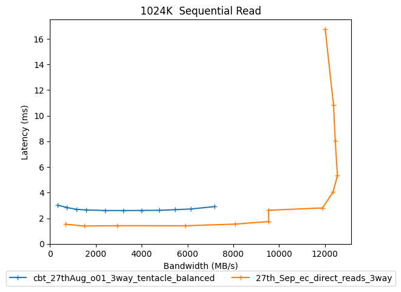
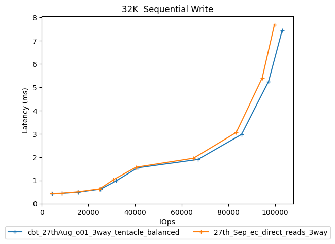

Comparitive Performance Report for cbt-27thAug-o01-3way-tentacle-balanced vs 27th-Sep-ec-direct-reads-3way
==========================================================================================================

Table of contents
=================

* [Comparison summary for cbt-27thAug-o01-3way-tentacle-balanced vs 27th-Sep-ec-direct-reads-3way](#comparison-summary-for-cbt-27thaug-o01-3way-tentacle-balanced-vs-27th-sep-ec-direct-reads-3way)
* [Response Curves](#response-curves)
	* [Sequential Read](#sequential-read)
	* [Sequential Write](#sequential-write)
	* [Random Read](#random-read)
	* [Random Write](#random-write)
	* [Random Read/Write](#random-readwrite)
* [Configuration yaml files](#configuration-yaml-files)
	* [results](#results)
	* [results](#results)

# Comparison summary for cbt-27thAug-o01-3way-tentacle-balanced vs 27th-Sep-ec-direct-reads-3way
  
|Sequential Read|cbt_27thAug_o01_3way_tentacle_balanced|27th_Sep_ec_direct_reads_3way|%change throughput|%change latency|  
| :--- | ---: | ---: | ---: | ---: |  
|[4K](#4096-read)|233243 IOps@1.6ms|220836 IOps@1.7ms|-5%|6%|  
|[8K](#8192-read)|218186 IOps@1.8ms|210231 IOps@1.8ms|-4%|0%|  
|[16K](#16384-read)|198882 IOps@1.4ms|191084 IOps@1.5ms|-4%|7%|  
|[32K](#32768-read)|149566 IOps@1.3ms|147245 IOps@1.3ms|-2%|0%|  
|[64K](#65536-read)|7786 MB/s@2.1ms|7625 MB/s@2.2ms|-2%|5%|  
|[256K](#262144-read)|11159 MB/s@1.5ms|11156 MB/s@12.0ms|-0%|700%|  
|[512K](#524288-read)|9144 MB/s@1.8ms|11982 MB/s@11.2ms|31%|522%|  
|[1024K](#1048576-read)|7178 MB/s@2.9ms|12551 MB/s@5.3ms|75%|83%|  
  
|Sequential Write|cbt_27thAug_o01_3way_tentacle_balanced|27th_Sep_ec_direct_reads_3way|%change throughput|%change latency|  
| :--- | ---: | ---: | ---: | ---: |  
|[4K](#4096-write)|510965 IOps@3.0ms|496157 IOps@3.1ms|-3%|3%|  
|[8K](#8192-write)|334276 IOps@4.6ms|328509 IOps@4.7ms|-2%|2%|  
|[16K](#16384-write)|184493 IOps@5.5ms|181537 IOps@5.6ms|-2%|2%|  
|[32K](#32768-write)|103026 IOps@7.4ms|99713 IOps@7.7ms|-3%|4%|  
|[64K](#65536-write)|3534 MB/s@9.5ms|3422 MB/s@9.8ms|-3%|3%|  
|[256K](#262144-write)|3949 MB/s@16.9ms|3853 MB/s@17.3ms|-2%|2%|  
|[512K](#524288-write)|4087 MB/s@8.0ms|3982 MB/s@8.2ms|-3%|2%|  
|[1024K](#1048576-write)|4020 MB/s@16.2ms|4071 MB/s@32.4ms|1%|100%|  
  
|Random Read|cbt_27thAug_o01_3way_tentacle_balanced|27th_Sep_ec_direct_reads_3way|%change throughput|%change latency|  
| :--- | ---: | ---: | ---: | ---: |  
|[4K](#4096-randread)|216530 IOps@3.5ms|204999 IOps@3.7ms|-5%|6%|  
|[8K](#8192-randread)|209775 IOps@3.7ms|196145 IOps@3.9ms|-6%|5%|  
|[16K](#16384-randread)|193403 IOps@3.0ms|180473 IOps@3.3ms|-7%|10%|  
|[32K](#32768-randread)|159835 IOps@3.2ms|152053 IOps@3.4ms|-5%|6%|  
|[64K](#65536-randread)|8100 MB/s@3.1ms|7786 MB/s@3.2ms|-4%|3%|  
|[256K](#262144-randread)|13168 MB/s@2.5ms|11532 MB/s@2.9ms|-12%|16%|  
|[512K](#524288-randread)|12732 MB/s@2.6ms|11996 MB/s@2.8ms|-6%|8%|  
|[1024K](#1048576-randread)|10192 MB/s@3.3ms|12190 MB/s@2.7ms|20%|-18%|  
  
|Random Write|cbt_27thAug_o01_3way_tentacle_balanced|27th_Sep_ec_direct_reads_3way|%change throughput|%change latency|  
| :--- | ---: | ---: | ---: | ---: |  
|[4K](#4096-randwrite)|51182 IOps@5.0ms|49410 IOps@5.2ms|-3%|4%|  
|[8K](#8192-randwrite)|48579 IOps@10.5ms|46732 IOps@8.2ms|-4%|-22%|  
|[16K](#16384-randwrite)|45875 IOps@11.1ms|44616 IOps@8.6ms|-3%|-23%|  
|[32K](#32768-randwrite)|43891 IOps@8.7ms|41611 IOps@9.2ms|-5%|6%|  
|[64K](#65536-randwrite)|2428 MB/s@10.3ms|2242 MB/s@11.2ms|-8%|9%|  
|[256K](#262144-randwrite)|4064 MB/s@4.0ms|3910 MB/s@6.3ms|-4%|57%|  
|[512K](#524288-randwrite)|4501 MB/s@7.2ms|4384 MB/s@7.4ms|-3%|3%|  
|[1024K](#1048576-randwrite)|4174 MB/s@5.6ms|4123 MB/s@7.7ms|-1%|38%|  
  
  
|Random Read/Write|cbt_27thAug_o01_3way_tentacle_balanced|27th_Sep_ec_direct_reads_3way|%change throughput|%change latency|  
| :--- | ---: | ---: | ---: | ---: |  
|[4K_70/30 ](#4096-70-30-randrw)|94949 IOps@4.0ms|90173 IOps@2.8ms|-5%|-30%|  
|[16K_70/30 ](#16384-70-30-randrw)|87433 IOps@2.9ms|85207 IOps@3.0ms|-3%|3%|  
|[64K_70/30 ](#65536-70-30-randrw)|4287 MB/s@3.9ms|4204 MB/s@4.0ms|-2%|3%|  
|[64K_30/70 ](#65536-30-70-randrw)|2901 MB/s@5.7ms|2745 MB/s@6.1ms|-5%|7%|  

# Response Curves

## Sequential Read

|||
| :---: | :---: |
|<a name="4096-read"></a>|<a name="8192-read"></a>|
|<a name="16384-read"></a>|<a name="32768-read"></a>|
|<a name="65536-read"></a>|<a name="262144-read"></a>|
|<a name="524288-read"></a>|<a name="1048576-read"></a>|

## Sequential Write

|||
| :---: | :---: |
|<a name="4096-write"></a>|<a name="8192-write"></a>|
|<a name="16384-write"></a>|<a name="32768-write"></a>|
|<a name="65536-write"></a>|<a name="262144-write"></a>|
|<a name="524288-write"></a>|<a name="1048576-write"></a>|

## Random Read

|||
| :---: | :---: |
|<a name="4096-randread"></a>|<a name="8192-randread"></a>|
|<a name="16384-randread"></a>|<a name="32768-randread"></a>|
|<a name="65536-randread"></a>|<a name="262144-randread"></a>|
|<a name="524288-randread"></a>|<a name="1048576-randread"></a>|

## Random Write

|||
| :---: | :---: |
|<a name="4096-randwrite"></a>|<a name="8192-randwrite"></a>|
|<a name="16384-randwrite"></a>|<a name="32768-randwrite"></a>|
|<a name="65536-randwrite"></a>|<a name="262144-randwrite"></a>|
|<a name="524288-randwrite"></a>|<a name="1048576-randwrite"></a>|

## Random Read/Write

|||
| :---: | :---: |
|<a name="4096-70-30-randrw"></a>|<a name="16384-70-30-randrw"></a>|
|<a name="65536-70-30-randrw"></a>|<a name="65536-30-70-randrw"></a>|

# Configuration yaml files


Only yaml files that differ by more than 20 lines from the yaml file for the baseline directory will be added here in addition to the baseline yaml  

## results


```benchmarks:
  librbdfio:
    cmd_path: /usr/local/bin/fio2
    fio_out_format: json
    log_avg_msec: 100
    log_bw: true
    log_iops: true
    log_lat: true
    norandommap: true
    osd_ra:
    - 4096
    poolname: rbd_replicated
    prefill:
      blocksize: 64k
      numjobs: 1
    procs_per_volume:
    - 1
    ramp: 30
    rbdname: cbt-librbdfio
    time: 90
    time_based: true
    use_existing_volumes: true
    vol_size: 608333
    volumes_per_client:
    - 16
    workloads:
      16k7030:
        jobname: randmix
        mode: randrw
        numjobs:
        - 1
        op_size: 16384
        rwmixread: 70
        total_iodepth:
        - 1
        - 2
        - 3
        - 4
        - 8
        - 16
        - 24
        - 32
        - 64
        - 128
        - 256
      16krandomread:
        jobname: randread
        mode: randread
        numjobs:
        - 1
        op_size: 16384
        total_iodepth:
        - 4
        - 8
        - 12
        - 16
        - 24
        - 48
        - 64
        - 128
        - 256
        - 384
        - 588
      16krandomwrite:
        jobname: randwrite
        mode: randwrite
        numjobs:
        - 1
        op_size: 16384
        total_iodepth:
        - 1
        - 2
        - 3
        - 4
        - 8
        - 16
        - 32
        - 64
        - 128
        - 256
        - 384
        - 512
      1Mrandomread:
        jobname: randread
        mode: randread
        numjobs:
        - 1
        op_size: 1048576
        total_iodepth:
        - 1
        - 2
        - 3
        - 4
        - 8
        - 12
        - 16
        - 20
        - 24
        - 28
        - 32
      1Mrandomwrite:
        jobname: randwrite
        mode: randwrite
        numjobs:
        - 1
        op_size: 1048576
        total_iodepth:
        - 1
        - 2
        - 3
        - 4
        - 5
        - 6
        - 8
        - 16
        - 24
        - 32
        - 48
      1Mseqread:
        jobname: seqread
        mode: read
        numjobs:
        - 1
        op_size: 1048576
        total_iodepth:
        - 1
        - 2
        - 3
        - 4
        - 6
        - 8
        - 10
        - 12
        - 14
        - 16
        - 20
      1Mseqwrite:
        jobname: seqwrite
        mode: write
        numjobs:
        - 1
        op_size: 1048576
        total_iodepth:
        - 2
        - 4
        - 6
        - 8
        - 16
        - 32
        - 48
        - 64
        - 96
        - 128
        - 160
      256krandomread:
        jobname: randread
        mode: randread
        numjobs:
        - 1
        op_size: 262144
        total_iodepth:
        - 1
        - 2
        - 3
        - 4
        - 5
        - 8
        - 16
        - 24
        - 32
        - 64
        - 128
      256krandomwrite:
        jobname: randwrite
        mode: randwrite
        numjobs:
        - 1
        op_size: 262144
        total_iodepth:
        - 1
        - 2
        - 3
        - 4
        - 5
        - 8
        - 16
        - 32
        - 64
        - 96
        - 128
        - 256
      32krandomread:
        jobname: randread
        mode: randread
        numjobs:
        - 1
        op_size: 32768
        total_iodepth:
        - 2
        - 4
        - 6
        - 8
        - 12
        - 16
        - 24
        - 32
        - 64
        - 128
        - 256
        - 384
        - 512
      32krandomwrite:
        jobname: randwrite
        mode: randwrite
        numjobs:
        - 1
        op_size: 32768
        total_iodepth:
        - 1
        - 2
        - 3
        - 4
        - 8
        - 16
        - 32
        - 64
        - 128
        - 256
        - 384
        - 512
      4k7030:
        jobname: randmix
        mode: randrw
        numjobs:
        - 1
        op_size: 4096
        rwmixread: 70
        total_iodepth:
        - 1
        - 2
        - 3
        - 4
        - 8
        - 16
        - 24
        - 32
        - 64
        - 128
        - 256
        - 384
      4krandomread:
        jobname: randread
        mode: randread
        numjobs:
        - 1
        op_size: 4096
        total_iodepth:
        - 4
        - 8
        - 12
        - 16
        - 32
        - 48
        - 64
        - 128
        - 256
        - 384
        - 588
        - 768
      4krandomwrite:
        jobname: randwrite
        mode: randwrite
        numjobs:
        - 1
        op_size: 4096
        total_iodepth:
        - 2
        - 4
        - 8
        - 16
        - 32
        - 64
        - 128
        - 256
        - 384
        - 512
        - 768
      512krandomread:
        jobname: randread
        mode: randread
        numjobs:
        - 1
        op_size: 524288
        total_iodepth:
        - 1
        - 2
        - 3
        - 4
        - 8
        - 16
        - 24
        - 32
        - 40
        - 48
        - 64
      512krandomwrite:
        jobname: randwrite
        mode: randwrite
        numjobs:
        - 1
        op_size: 524288
        total_iodepth:
        - 1
        - 2
        - 3
        - 4
        - 5
        - 6
        - 8
        - 16
        - 24
        - 32
        - 48
        - 64
      512kseqread:
        jobname: seqread
        mode: read
        numjobs:
        - 1
        op_size: 524288
        total_iodepth:
        - 1
        - 2
        - 3
        - 4
        - 6
        - 8
        - 12
        - 16
        - 20
        - 24
        - 32
      512kseqwrite:
        jobname: seqwrite
        mode: write
        numjobs:
        - 1
        op_size: 524288
        total_iodepth:
        - 1
        - 2
        - 4
        - 6
        - 8
        - 16
        - 32
        - 48
        - 64
        - 96
        - 128
      64k3070:
        jobname: randmix
        mode: randrw
        numjobs:
        - 1
        op_size: 65536
        rwmixread: 30
        total_iodepth:
        - 1
        - 2
        - 3
        - 4
        - 8
        - 16
        - 32
        - 64
        - 96
        - 128
        - 256
      64k7030:
        jobname: randmix
        mode: randrw
        numjobs:
        - 1
        op_size: 65536
        rwmixread: 70
        total_iodepth:
        - 1
        - 2
        - 3
        - 4
        - 8
        - 16
        - 32
        - 64
        - 96
        - 128
        - 256
      64krandomread:
        jobname: randread
        mode: randread
        numjobs:
        - 1
        op_size: 65536
        total_iodepth:
        - 2
        - 4
        - 6
        - 8
        - 12
        - 16
        - 24
        - 32
        - 64
        - 128
        - 256
        - 384
      64krandomwrite:
        jobname: randwrite
        mode: randwrite
        numjobs:
        - 1
        op_size: 65536
        total_iodepth:
        - 2
        - 4
        - 6
        - 8
        - 16
        - 24
        - 32
        - 64
        - 128
        - 256
        - 384
      64kseqread:
        jobname: read
        mode: read
        numjobs:
        - 1
        op_size: 65536
        total_iodepth:
        - 2
        - 4
        - 6
        - 8
        - 16
        - 24
        - 32
        - 64
        - 128
        - 192
        - 256
      64kseqwrite:
        jobname: write
        mode: write
        numjobs:
        - 1
        op_size: 65536
        total_iodepth:
        - 4
        - 8
        - 12
        - 16
        - 32
        - 48
        - 64
        - 128
        - 256
        - 384
        - 512
      8krandomread:
        jobname: randread
        mode: randread
        numjobs:
        - 1
        op_size: 8192
        total_iodepth:
        - 4
        - 8
        - 12
        - 16
        - 32
        - 48
        - 64
        - 128
        - 256
        - 384
        - 588
        - 768
      8krandomwrite:
        jobname: randwrite
        mode: randwrite
        numjobs:
        - 1
        op_size: 8192
        total_iodepth:
        - 2
        - 4
        - 8
        - 16
        - 32
        - 64
        - 128
        - 256
        - 384
        - 512
        - 768
      precondition:
        jobname: precond1rw
        mode: randwrite
        monitor: false
        numjobs:
        - 1
        op_size: 65536
        time: 600
        total_iodepth:
        - 16
      seq16kread:
        jobname: seqread
        mode: read
        numjobs:
        - 1
        op_size: 16384
        total_iodepth:
        - 2
        - 4
        - 8
        - 12
        - 16
        - 24
        - 32
        - 64
        - 96
        - 128
        - 192
        - 288
      seq16kwrite:
        jobname: seqwrite
        mode: write
        numjobs:
        - 1
        op_size: 16384
        total_iodepth:
        - 2
        - 4
        - 8
        - 16
        - 32
        - 48
        - 64
        - 128
        - 256
        - 384
        - 512
        - 768
        - 1024
      seq256kread:
        jobname: seqread
        mode: read
        numjobs:
        - 1
        op_size: 262144
        total_iodepth:
        - 1
        - 2
        - 3
        - 4
        - 5
        - 8
        - 16
        - 24
        - 32
        - 48
        - 64
      seq256kwrite:
        jobname: seqwrite
        mode: write
        numjobs:
        - 1
        op_size: 262144
        total_iodepth:
        - 1
        - 2
        - 4
        - 8
        - 16
        - 24
        - 32
        - 64
        - 96
        - 128
        - 256
      seq32kread:
        jobname: seqread
        mode: read
        numjobs:
        - 1
        op_size: 32768
        total_iodepth:
        - 2
        - 4
        - 8
        - 12
        - 16
        - 24
        - 32
        - 64
        - 96
        - 128
        - 192
      seq32kwrite:
        jobname: seqwrite
        mode: write
        numjobs:
        - 1
        op_size: 32768
        total_iodepth:
        - 2
        - 4
        - 8
        - 16
        - 32
        - 64
        - 128
        - 256
        - 512
        - 768
      seq4kread:
        jobname: seqread
        mode: read
        numjobs:
        - 1
        op_size: 4096
        total_iodepth:
        - 2
        - 4
        - 8
        - 12
        - 16
        - 24
        - 32
        - 64
        - 96
        - 128
        - 192
        - 288
        - 384
      seq4kwrite:
        jobname: seqwrite
        mode: write
        numjobs:
        - 1
        op_size: 4096
        total_iodepth:
        - 2
        - 8
        - 16
        - 24
        - 32
        - 48
        - 64
        - 128
        - 256
        - 384
        - 512
        - 768
        - 1024
        - 1280
        - 1536
      seq8kread:
        jobname: seqread
        mode: read
        numjobs:
        - 1
        op_size: 8192
        total_iodepth:
        - 2
        - 4
        - 8
        - 12
        - 16
        - 24
        - 32
        - 64
        - 96
        - 128
        - 192
        - 288
        - 384
      seq8kwrite:
        jobname: seqwrite
        mode: write
        numjobs:
        - 1
        op_size: 8192
        total_iodepth:
        - 2
        - 8
        - 16
        - 24
        - 32
        - 48
        - 64
        - 128
        - 256
        - 384
        - 512
        - 768
        - 1024
        - 1280
        - 1536
cluster:
  archive_dir: /tmp/cbt
  ceph-mgr_cmd: /usr/bin/ceph-mgr
  ceph-mon_cmd: /usr/bin/ceph-mon
  ceph-osd_cmd: /usr/bin/ceph-osd
  ceph-run_cmd: /usr/bin/ceph-run
  ceph_cmd: /usr/bin/ceph
  clients:
  - --- server1 ---
  clusterid: ceph
  conf_file: /cbt/ceph.conf.4x1x1.fs
  fs: xfs
  head: --- server1 ---
  iterations: 1
  mgrs:
    --- server1 ---:
      a: null
  mkfs_opts: -f -i size=2048
  mons:
    --- server1 ---:
      a: --- IP Address --:6789
  mount_opts: -o inode64,noatime,logbsize=256k
  osds:
  - --- server1 ---
  osds_per_node: 8
  pdsh_ssh_args: -a -x -l%u %h
  rados_cmd: /usr/bin/rados
  rbd_cmd: /usr/bin/rbd
  tmp_dir: /tmp/cbt
  use_existing: true
  user: ljsanders
monitoring_profiles:
  collectl:
    args: -c 18 -sCD -i 10 -P -oz -F0 --rawtoo --sep ";" -f {collectl_dir}
```

```benchmarks:
  librbdfio:
    cmd_path: /usr/local/bin/fio2
    fio_out_format: json
    log_avg_msec: 100
    log_bw: true
    log_iops: true
    log_lat: true
    norandommap: true
    osd_ra:
    - 4096
    poolname: rbd_replicated
    prefill:
      blocksize: 64k
      numjobs: 1
    procs_per_volume:
    - 1
    ramp: 30
    rbdname: cbt-librbdfio
    time: 90
    time_based: true
    use_existing_volumes: true
    vol_size: 608333
    volumes_per_client:
    - 16
    workloads:
      16k7030:
        jobname: randmix
        mode: randrw
        numjobs:
        - 1
        op_size: 16384
        rwmixread: 70
        total_iodepth:
        - 1
        - 2
        - 3
        - 4
        - 8
        - 16
        - 24
        - 32
        - 64
        - 128
        - 256
      16krandomread:
        jobname: randread
        mode: randread
        numjobs:
        - 1
        op_size: 16384
        total_iodepth:
        - 4
        - 8
        - 12
        - 16
        - 24
        - 48
        - 64
        - 128
        - 256
        - 384
        - 588
      16krandomwrite:
        jobname: randwrite
        mode: randwrite
        numjobs:
        - 1
        op_size: 16384
        total_iodepth:
        - 1
        - 2
        - 3
        - 4
        - 8
        - 16
        - 32
        - 64
        - 128
        - 256
        - 384
        - 512
      1Mrandomread:
        jobname: randread
        mode: randread
        numjobs:
        - 1
        op_size: 1048576
        total_iodepth:
        - 1
        - 2
        - 3
        - 4
        - 8
        - 12
        - 16
        - 20
        - 24
        - 28
        - 32
      1Mrandomwrite:
        jobname: randwrite
        mode: randwrite
        numjobs:
        - 1
        op_size: 1048576
        total_iodepth:
        - 1
        - 2
        - 3
        - 4
        - 5
        - 6
        - 8
        - 16
        - 24
        - 32
        - 48
      1Mseqread:
        jobname: seqread
        mode: read
        numjobs:
        - 1
        op_size: 1048576
        total_iodepth:
        - 1
        - 2
        - 3
        - 4
        - 6
        - 8
        - 10
        - 12
        - 14
        - 16
        - 20
      1Mseqwrite:
        jobname: seqwrite
        mode: write
        numjobs:
        - 1
        op_size: 1048576
        total_iodepth:
        - 2
        - 4
        - 6
        - 8
        - 16
        - 32
        - 48
        - 64
        - 96
        - 128
        - 160
      256krandomread:
        jobname: randread
        mode: randread
        numjobs:
        - 1
        op_size: 262144
        total_iodepth:
        - 1
        - 2
        - 3
        - 4
        - 5
        - 8
        - 16
        - 24
        - 32
        - 64
        - 128
      256krandomwrite:
        jobname: randwrite
        mode: randwrite
        numjobs:
        - 1
        op_size: 262144
        total_iodepth:
        - 1
        - 2
        - 3
        - 4
        - 5
        - 8
        - 16
        - 32
        - 64
        - 96
        - 128
        - 256
      32krandomread:
        jobname: randread
        mode: randread
        numjobs:
        - 1
        op_size: 32768
        total_iodepth:
        - 2
        - 4
        - 6
        - 8
        - 12
        - 16
        - 24
        - 32
        - 64
        - 128
        - 256
        - 384
        - 512
      32krandomwrite:
        jobname: randwrite
        mode: randwrite
        numjobs:
        - 1
        op_size: 32768
        total_iodepth:
        - 1
        - 2
        - 3
        - 4
        - 8
        - 16
        - 32
        - 64
        - 128
        - 256
        - 384
        - 512
      4k7030:
        jobname: randmix
        mode: randrw
        numjobs:
        - 1
        op_size: 4096
        rwmixread: 70
        total_iodepth:
        - 1
        - 2
        - 3
        - 4
        - 8
        - 16
        - 24
        - 32
        - 64
        - 128
        - 256
        - 384
      4krandomread:
        jobname: randread
        mode: randread
        numjobs:
        - 1
        op_size: 4096
        total_iodepth:
        - 4
        - 8
        - 12
        - 16
        - 32
        - 48
        - 64
        - 128
        - 256
        - 384
        - 588
        - 768
      4krandomwrite:
        jobname: randwrite
        mode: randwrite
        numjobs:
        - 1
        op_size: 4096
        total_iodepth:
        - 2
        - 4
        - 8
        - 16
        - 32
        - 64
        - 128
        - 256
        - 384
        - 512
        - 768
      512krandomread:
        jobname: randread
        mode: randread
        numjobs:
        - 1
        op_size: 524288
        total_iodepth:
        - 1
        - 2
        - 3
        - 4
        - 8
        - 16
        - 24
        - 32
        - 40
        - 48
        - 64
      512krandomwrite:
        jobname: randwrite
        mode: randwrite
        numjobs:
        - 1
        op_size: 524288
        total_iodepth:
        - 1
        - 2
        - 3
        - 4
        - 5
        - 6
        - 8
        - 16
        - 24
        - 32
        - 48
        - 64
      512kseqread:
        jobname: seqread
        mode: read
        numjobs:
        - 1
        op_size: 524288
        total_iodepth:
        - 1
        - 2
        - 3
        - 4
        - 6
        - 8
        - 12
        - 16
        - 20
        - 24
        - 32
      512kseqwrite:
        jobname: seqwrite
        mode: write
        numjobs:
        - 1
        op_size: 524288
        total_iodepth:
        - 1
        - 2
        - 4
        - 6
        - 8
        - 16
        - 32
        - 48
        - 64
        - 96
        - 128
      64k3070:
        jobname: randmix
        mode: randrw
        numjobs:
        - 1
        op_size: 65536
        rwmixread: 30
        total_iodepth:
        - 1
        - 2
        - 3
        - 4
        - 8
        - 16
        - 32
        - 64
        - 96
        - 128
        - 256
      64k7030:
        jobname: randmix
        mode: randrw
        numjobs:
        - 1
        op_size: 65536
        rwmixread: 70
        total_iodepth:
        - 1
        - 2
        - 3
        - 4
        - 8
        - 16
        - 32
        - 64
        - 96
        - 128
        - 256
      64krandomread:
        jobname: randread
        mode: randread
        numjobs:
        - 1
        op_size: 65536
        total_iodepth:
        - 2
        - 4
        - 6
        - 8
        - 12
        - 16
        - 24
        - 32
        - 64
        - 128
        - 256
        - 384
      64krandomwrite:
        jobname: randwrite
        mode: randwrite
        numjobs:
        - 1
        op_size: 65536
        total_iodepth:
        - 2
        - 4
        - 6
        - 8
        - 16
        - 24
        - 32
        - 64
        - 128
        - 256
        - 384
      64kseqread:
        jobname: read
        mode: read
        numjobs:
        - 1
        op_size: 65536
        total_iodepth:
        - 2
        - 4
        - 6
        - 8
        - 16
        - 24
        - 32
        - 64
        - 128
        - 192
        - 256
      64kseqwrite:
        jobname: write
        mode: write
        numjobs:
        - 1
        op_size: 65536
        total_iodepth:
        - 4
        - 8
        - 12
        - 16
        - 32
        - 48
        - 64
        - 128
        - 256
        - 384
        - 512
      8krandomread:
        jobname: randread
        mode: randread
        numjobs:
        - 1
        op_size: 8192
        total_iodepth:
        - 4
        - 8
        - 12
        - 16
        - 32
        - 48
        - 64
        - 128
        - 256
        - 384
        - 588
        - 768
      8krandomwrite:
        jobname: randwrite
        mode: randwrite
        numjobs:
        - 1
        op_size: 8192
        total_iodepth:
        - 2
        - 4
        - 8
        - 16
        - 32
        - 64
        - 128
        - 256
        - 384
        - 512
        - 768
      precondition:
        jobname: precond1rw
        mode: randwrite
        monitor: false
        numjobs:
        - 1
        op_size: 65536
        time: 600
        total_iodepth:
        - 16
      seq16kread:
        jobname: seqread
        mode: read
        numjobs:
        - 1
        op_size: 16384
        total_iodepth:
        - 2
        - 4
        - 8
        - 12
        - 16
        - 24
        - 32
        - 64
        - 96
        - 128
        - 192
        - 288
      seq16kwrite:
        jobname: seqwrite
        mode: write
        numjobs:
        - 1
        op_size: 16384
        total_iodepth:
        - 2
        - 4
        - 8
        - 16
        - 32
        - 48
        - 64
        - 128
        - 256
        - 384
        - 512
        - 768
        - 1024
      seq256kread:
        jobname: seqread
        mode: read
        numjobs:
        - 1
        op_size: 262144
        total_iodepth:
        - 1
        - 2
        - 3
        - 4
        - 5
        - 8
        - 16
        - 24
        - 32
        - 48
        - 64
      seq256kwrite:
        jobname: seqwrite
        mode: write
        numjobs:
        - 1
        op_size: 262144
        total_iodepth:
        - 1
        - 2
        - 4
        - 8
        - 16
        - 24
        - 32
        - 64
        - 96
        - 128
        - 256
      seq32kread:
        jobname: seqread
        mode: read
        numjobs:
        - 1
        op_size: 32768
        total_iodepth:
        - 2
        - 4
        - 8
        - 12
        - 16
        - 24
        - 32
        - 64
        - 96
        - 128
        - 192
      seq32kwrite:
        jobname: seqwrite
        mode: write
        numjobs:
        - 1
        op_size: 32768
        total_iodepth:
        - 2
        - 4
        - 8
        - 16
        - 32
        - 64
        - 128
        - 256
        - 512
        - 768
      seq4kread:
        jobname: seqread
        mode: read
        numjobs:
        - 1
        op_size: 4096
        total_iodepth:
        - 2
        - 4
        - 8
        - 12
        - 16
        - 24
        - 32
        - 64
        - 96
        - 128
        - 192
        - 288
        - 384
      seq4kwrite:
        jobname: seqwrite
        mode: write
        numjobs:
        - 1
        op_size: 4096
        total_iodepth:
        - 2
        - 8
        - 16
        - 24
        - 32
        - 48
        - 64
        - 128
        - 256
        - 384
        - 512
        - 768
        - 1024
        - 1280
        - 1536
      seq8kread:
        jobname: seqread
        mode: read
        numjobs:
        - 1
        op_size: 8192
        total_iodepth:
        - 2
        - 4
        - 8
        - 12
        - 16
        - 24
        - 32
        - 64
        - 96
        - 128
        - 192
        - 288
        - 384
      seq8kwrite:
        jobname: seqwrite
        mode: write
        numjobs:
        - 1
        op_size: 8192
        total_iodepth:
        - 2
        - 8
        - 16
        - 24
        - 32
        - 48
        - 64
        - 128
        - 256
        - 384
        - 512
        - 768
        - 1024
        - 1280
        - 1536
cluster:
  archive_dir: /tmp/cbt
  ceph-mgr_cmd: /usr/bin/ceph-mgr
  ceph-mon_cmd: /usr/bin/ceph-mon
  ceph-osd_cmd: /usr/bin/ceph-osd
  ceph-run_cmd: /usr/bin/ceph-run
  ceph_cmd: /usr/bin/ceph
  clients:
  - --- server1 ---
  clusterid: ceph
  conf_file: /cbt/ceph.conf.4x1x1.fs
  fs: xfs
  head: --- server1 ---
  iterations: 1
  mgrs:
    --- server1 ---:
      a: null
  mkfs_opts: -f -i size=2048
  mons:
    --- server1 ---:
      a: --- IP Address --:6789
  mount_opts: -o inode64,noatime,logbsize=256k
  osds:
  - --- server1 ---
  osds_per_node: 8
  pdsh_ssh_args: -a -x -l%u %h
  rados_cmd: /usr/bin/rados
  rbd_cmd: /usr/bin/rbd
  tmp_dir: /tmp/cbt
  use_existing: true
  user: ljsanders
monitoring_profiles:
  collectl:
    args: -c 18 -sCD -i 10 -P -oz -F0 --rawtoo --sep ";" -f {collectl_dir}
```
## results


```benchmarks:
  librbdfio:
    cmd_path: /usr/local/bin/fio2
    fio_out_format: json
    log_avg_msec: 100
    log_bw: true
    log_iops: true
    log_lat: true
    norandommap: true
    osd_ra:
    - 4096
    poolname: rbd_replicated
    prefill:
      blocksize: 64k
      numjobs: 1
    procs_per_volume:
    - 1
    ramp: 30
    rbdname: cbt-librbdfio
    time: 90
    time_based: true
    use_existing_volumes: true
    vol_size: 608333
    volumes_per_client:
    - 16
    workloads:
      16k7030:
        jobname: randmix
        mode: randrw
        numjobs:
        - 1
        op_size: 16384
        rwmixread: 70
        total_iodepth:
        - 1
        - 2
        - 3
        - 4
        - 8
        - 16
        - 24
        - 32
        - 64
        - 128
        - 256
      16krandomread:
        jobname: randread
        mode: randread
        numjobs:
        - 1
        op_size: 16384
        total_iodepth:
        - 4
        - 8
        - 12
        - 16
        - 24
        - 48
        - 64
        - 128
        - 256
        - 384
        - 588
      16krandomwrite:
        jobname: randwrite
        mode: randwrite
        numjobs:
        - 1
        op_size: 16384
        total_iodepth:
        - 1
        - 2
        - 3
        - 4
        - 8
        - 16
        - 32
        - 64
        - 128
        - 256
        - 384
        - 512
      1Mrandomread:
        jobname: randread
        mode: randread
        numjobs:
        - 1
        op_size: 1048576
        total_iodepth:
        - 1
        - 2
        - 3
        - 4
        - 8
        - 12
        - 16
        - 20
        - 24
        - 28
        - 32
      1Mrandomwrite:
        jobname: randwrite
        mode: randwrite
        numjobs:
        - 1
        op_size: 1048576
        total_iodepth:
        - 1
        - 2
        - 3
        - 4
        - 5
        - 6
        - 8
        - 16
        - 24
        - 32
        - 48
      1Mseqread:
        jobname: seqread
        mode: read
        numjobs:
        - 1
        op_size: 1048576
        total_iodepth:
        - 1
        - 2
        - 4
        - 8
        - 12
        - 16
        - 24
        - 32
        - 48
        - 64
        - 96
        - 128
        - 192
      1Mseqwrite:
        jobname: seqwrite
        mode: write
        numjobs:
        - 1
        op_size: 1048576
        total_iodepth:
        - 2
        - 4
        - 6
        - 8
        - 16
        - 32
        - 48
        - 64
        - 96
        - 128
        - 160
      256krandomread:
        jobname: randread
        mode: randread
        numjobs:
        - 1
        op_size: 262144
        total_iodepth:
        - 1
        - 2
        - 3
        - 4
        - 5
        - 8
        - 16
        - 24
        - 32
        - 64
        - 128
      256krandomwrite:
        jobname: randwrite
        mode: randwrite
        numjobs:
        - 1
        op_size: 262144
        total_iodepth:
        - 1
        - 2
        - 3
        - 4
        - 5
        - 8
        - 16
        - 32
        - 64
        - 96
        - 128
        - 256
      32krandomread:
        jobname: randread
        mode: randread
        numjobs:
        - 1
        op_size: 32768
        total_iodepth:
        - 2
        - 4
        - 6
        - 8
        - 12
        - 16
        - 24
        - 32
        - 64
        - 128
        - 256
        - 384
        - 512
      32krandomwrite:
        jobname: randwrite
        mode: randwrite
        numjobs:
        - 1
        op_size: 32768
        total_iodepth:
        - 1
        - 2
        - 3
        - 4
        - 8
        - 16
        - 32
        - 64
        - 128
        - 256
        - 384
        - 512
      4k7030:
        jobname: randmix
        mode: randrw
        numjobs:
        - 1
        op_size: 4096
        rwmixread: 70
        total_iodepth:
        - 1
        - 2
        - 3
        - 4
        - 8
        - 16
        - 24
        - 32
        - 64
        - 128
        - 256
        - 384
      4krandomread:
        jobname: randread
        mode: randread
        numjobs:
        - 1
        op_size: 4096
        total_iodepth:
        - 4
        - 8
        - 12
        - 16
        - 32
        - 48
        - 64
        - 128
        - 256
        - 384
        - 588
        - 768
      4krandomwrite:
        jobname: randwrite
        mode: randwrite
        numjobs:
        - 1
        op_size: 4096
        total_iodepth:
        - 2
        - 4
        - 8
        - 16
        - 32
        - 64
        - 128
        - 256
        - 384
        - 512
        - 768
      512krandomread:
        jobname: randread
        mode: randread
        numjobs:
        - 1
        op_size: 524288
        total_iodepth:
        - 1
        - 2
        - 3
        - 4
        - 8
        - 16
        - 24
        - 32
        - 40
        - 48
        - 64
      512krandomwrite:
        jobname: randwrite
        mode: randwrite
        numjobs:
        - 1
        op_size: 524288
        total_iodepth:
        - 1
        - 2
        - 3
        - 4
        - 5
        - 6
        - 8
        - 16
        - 24
        - 32
        - 48
        - 64
      512kseqread:
        jobname: seqread
        mode: read
        numjobs:
        - 1
        op_size: 524288
        total_iodepth:
        - 1
        - 2
        - 4
        - 8
        - 12
        - 16
        - 24
        - 32
        - 48
        - 64
        - 96
        - 128
        - 256
      512kseqwrite:
        jobname: seqwrite
        mode: write
        numjobs:
        - 1
        op_size: 524288
        total_iodepth:
        - 1
        - 2
        - 4
        - 6
        - 8
        - 16
        - 32
        - 48
        - 64
        - 96
        - 128
      64k3070:
        jobname: randmix
        mode: randrw
        numjobs:
        - 1
        op_size: 65536
        rwmixread: 30
        total_iodepth:
        - 1
        - 2
        - 3
        - 4
        - 8
        - 16
        - 32
        - 64
        - 96
        - 128
        - 256
      64k7030:
        jobname: randmix
        mode: randrw
        numjobs:
        - 1
        op_size: 65536
        rwmixread: 70
        total_iodepth:
        - 1
        - 2
        - 3
        - 4
        - 8
        - 16
        - 32
        - 64
        - 96
        - 128
        - 256
      64krandomread:
        jobname: randread
        mode: randread
        numjobs:
        - 1
        op_size: 65536
        total_iodepth:
        - 2
        - 4
        - 6
        - 8
        - 12
        - 16
        - 24
        - 32
        - 64
        - 128
        - 256
        - 384
      64krandomwrite:
        jobname: randwrite
        mode: randwrite
        numjobs:
        - 1
        op_size: 65536
        total_iodepth:
        - 2
        - 4
        - 6
        - 8
        - 16
        - 24
        - 32
        - 64
        - 128
        - 256
        - 384
      64kseqread:
        jobname: read
        mode: read
        numjobs:
        - 1
        op_size: 65536
        total_iodepth:
        - 2
        - 4
        - 6
        - 8
        - 16
        - 24
        - 32
        - 64
        - 128
        - 192
        - 256
      64kseqwrite:
        jobname: write
        mode: write
        numjobs:
        - 1
        op_size: 65536
        total_iodepth:
        - 4
        - 8
        - 12
        - 16
        - 32
        - 48
        - 64
        - 128
        - 256
        - 384
        - 512
      8krandomread:
        jobname: randread
        mode: randread
        numjobs:
        - 1
        op_size: 8192
        total_iodepth:
        - 4
        - 8
        - 12
        - 16
        - 32
        - 48
        - 64
        - 128
        - 256
        - 384
        - 588
        - 768
      8krandomwrite:
        jobname: randwrite
        mode: randwrite
        numjobs:
        - 1
        op_size: 8192
        total_iodepth:
        - 2
        - 4
        - 8
        - 16
        - 32
        - 64
        - 128
        - 256
        - 384
        - 512
        - 768
      precondition:
        jobname: precond1rw
        mode: randwrite
        monitor: false
        numjobs:
        - 1
        op_size: 65536
        time: 600
        total_iodepth:
        - 16
      seq16kread:
        jobname: seqread
        mode: read
        numjobs:
        - 1
        op_size: 16384
        total_iodepth:
        - 2
        - 4
        - 8
        - 12
        - 16
        - 24
        - 32
        - 64
        - 96
        - 128
        - 192
        - 288
      seq16kwrite:
        jobname: seqwrite
        mode: write
        numjobs:
        - 1
        op_size: 16384
        total_iodepth:
        - 2
        - 4
        - 8
        - 16
        - 32
        - 48
        - 64
        - 128
        - 256
        - 384
        - 512
        - 768
        - 1024
      seq256kread:
        jobname: seqread
        mode: read
        numjobs:
        - 1
        op_size: 262144
        total_iodepth:
        - 1
        - 2
        - 4
        - 8
        - 16
        - 32
        - 64
        - 128
        - 256
        - 512
      seq256kwrite:
        jobname: seqwrite
        mode: write
        numjobs:
        - 1
        op_size: 262144
        total_iodepth:
        - 1
        - 2
        - 4
        - 8
        - 16
        - 24
        - 32
        - 64
        - 96
        - 128
        - 256
      seq32kread:
        jobname: seqread
        mode: read
        numjobs:
        - 1
        op_size: 32768
        total_iodepth:
        - 2
        - 4
        - 8
        - 12
        - 16
        - 24
        - 32
        - 64
        - 96
        - 128
        - 192
      seq32kwrite:
        jobname: seqwrite
        mode: write
        numjobs:
        - 1
        op_size: 32768
        total_iodepth:
        - 2
        - 4
        - 8
        - 16
        - 32
        - 64
        - 128
        - 256
        - 512
        - 768
      seq4kread:
        jobname: seqread
        mode: read
        numjobs:
        - 1
        op_size: 4096
        total_iodepth:
        - 2
        - 4
        - 8
        - 12
        - 16
        - 24
        - 32
        - 64
        - 96
        - 128
        - 192
        - 288
        - 384
      seq4kwrite:
        jobname: seqwrite
        mode: write
        numjobs:
        - 1
        op_size: 4096
        total_iodepth:
        - 2
        - 8
        - 16
        - 24
        - 32
        - 48
        - 64
        - 128
        - 256
        - 384
        - 512
        - 768
        - 1024
        - 1280
        - 1536
      seq8kread:
        jobname: seqread
        mode: read
        numjobs:
        - 1
        op_size: 8192
        total_iodepth:
        - 2
        - 4
        - 8
        - 12
        - 16
        - 24
        - 32
        - 64
        - 96
        - 128
        - 192
        - 288
        - 384
      seq8kwrite:
        jobname: seqwrite
        mode: write
        numjobs:
        - 1
        op_size: 8192
        total_iodepth:
        - 2
        - 8
        - 16
        - 24
        - 32
        - 48
        - 64
        - 128
        - 256
        - 384
        - 512
        - 768
        - 1024
        - 1280
        - 1536
cluster:
  archive_dir: /tmp/cbt
  ceph-mgr_cmd: /usr/bin/ceph-mgr
  ceph-mon_cmd: /usr/bin/ceph-mon
  ceph-osd_cmd: /usr/bin/ceph-osd
  ceph-run_cmd: /usr/bin/ceph-run
  ceph_cmd: /usr/bin/ceph
  clients:
  - --- server1 ---
  clusterid: ceph
  conf_file: /cbt/ceph.conf.4x1x1.fs
  fs: xfs
  head: --- server1 ---
  iterations: 1
  mgrs:
    --- server1 ---:
      a: null
  mkfs_opts: -f -i size=2048
  mons:
    --- server1 ---:
      a: --- IP Address --:6789
  mount_opts: -o inode64,noatime,logbsize=256k
  osds:
  - --- server1 ---
  osds_per_node: 8
  pdsh_ssh_args: -a -x -l%u %h
  rados_cmd: /usr/bin/rados
  rbd_cmd: /usr/bin/rbd
  tmp_dir: /tmp/cbt
  use_existing: true
  user: ljsanders
monitoring_profiles:
  collectl:
    args: -c 18 -sCD -i 10 -P -oz -F0 --rawtoo --sep ";" -f {collectl_dir}
```

```benchmarks:
  librbdfio:
    cmd_path: /usr/local/bin/fio2
    fio_out_format: json
    log_avg_msec: 100
    log_bw: true
    log_iops: true
    log_lat: true
    norandommap: true
    osd_ra:
    - 4096
    poolname: rbd_replicated
    prefill:
      blocksize: 64k
      numjobs: 1
    procs_per_volume:
    - 1
    ramp: 30
    rbdname: cbt-librbdfio
    time: 90
    time_based: true
    use_existing_volumes: true
    vol_size: 608333
    volumes_per_client:
    - 16
    workloads:
      16k7030:
        jobname: randmix
        mode: randrw
        numjobs:
        - 1
        op_size: 16384
        rwmixread: 70
        total_iodepth:
        - 1
        - 2
        - 3
        - 4
        - 8
        - 16
        - 24
        - 32
        - 64
        - 128
        - 256
      16krandomread:
        jobname: randread
        mode: randread
        numjobs:
        - 1
        op_size: 16384
        total_iodepth:
        - 4
        - 8
        - 12
        - 16
        - 24
        - 48
        - 64
        - 128
        - 256
        - 384
        - 588
      16krandomwrite:
        jobname: randwrite
        mode: randwrite
        numjobs:
        - 1
        op_size: 16384
        total_iodepth:
        - 1
        - 2
        - 3
        - 4
        - 8
        - 16
        - 32
        - 64
        - 128
        - 256
        - 384
        - 512
      1Mrandomread:
        jobname: randread
        mode: randread
        numjobs:
        - 1
        op_size: 1048576
        total_iodepth:
        - 1
        - 2
        - 3
        - 4
        - 8
        - 12
        - 16
        - 20
        - 24
        - 28
        - 32
      1Mrandomwrite:
        jobname: randwrite
        mode: randwrite
        numjobs:
        - 1
        op_size: 1048576
        total_iodepth:
        - 1
        - 2
        - 3
        - 4
        - 5
        - 6
        - 8
        - 16
        - 24
        - 32
        - 48
      1Mseqread:
        jobname: seqread
        mode: read
        numjobs:
        - 1
        op_size: 1048576
        total_iodepth:
        - 1
        - 2
        - 4
        - 8
        - 12
        - 16
        - 24
        - 32
        - 48
        - 64
        - 96
        - 128
        - 192
      1Mseqwrite:
        jobname: seqwrite
        mode: write
        numjobs:
        - 1
        op_size: 1048576
        total_iodepth:
        - 2
        - 4
        - 6
        - 8
        - 16
        - 32
        - 48
        - 64
        - 96
        - 128
        - 160
      256krandomread:
        jobname: randread
        mode: randread
        numjobs:
        - 1
        op_size: 262144
        total_iodepth:
        - 1
        - 2
        - 3
        - 4
        - 5
        - 8
        - 16
        - 24
        - 32
        - 64
        - 128
      256krandomwrite:
        jobname: randwrite
        mode: randwrite
        numjobs:
        - 1
        op_size: 262144
        total_iodepth:
        - 1
        - 2
        - 3
        - 4
        - 5
        - 8
        - 16
        - 32
        - 64
        - 96
        - 128
        - 256
      32krandomread:
        jobname: randread
        mode: randread
        numjobs:
        - 1
        op_size: 32768
        total_iodepth:
        - 2
        - 4
        - 6
        - 8
        - 12
        - 16
        - 24
        - 32
        - 64
        - 128
        - 256
        - 384
        - 512
      32krandomwrite:
        jobname: randwrite
        mode: randwrite
        numjobs:
        - 1
        op_size: 32768
        total_iodepth:
        - 1
        - 2
        - 3
        - 4
        - 8
        - 16
        - 32
        - 64
        - 128
        - 256
        - 384
        - 512
      4k7030:
        jobname: randmix
        mode: randrw
        numjobs:
        - 1
        op_size: 4096
        rwmixread: 70
        total_iodepth:
        - 1
        - 2
        - 3
        - 4
        - 8
        - 16
        - 24
        - 32
        - 64
        - 128
        - 256
        - 384
      4krandomread:
        jobname: randread
        mode: randread
        numjobs:
        - 1
        op_size: 4096
        total_iodepth:
        - 4
        - 8
        - 12
        - 16
        - 32
        - 48
        - 64
        - 128
        - 256
        - 384
        - 588
        - 768
      4krandomwrite:
        jobname: randwrite
        mode: randwrite
        numjobs:
        - 1
        op_size: 4096
        total_iodepth:
        - 2
        - 4
        - 8
        - 16
        - 32
        - 64
        - 128
        - 256
        - 384
        - 512
        - 768
      512krandomread:
        jobname: randread
        mode: randread
        numjobs:
        - 1
        op_size: 524288
        total_iodepth:
        - 1
        - 2
        - 3
        - 4
        - 8
        - 16
        - 24
        - 32
        - 40
        - 48
        - 64
      512krandomwrite:
        jobname: randwrite
        mode: randwrite
        numjobs:
        - 1
        op_size: 524288
        total_iodepth:
        - 1
        - 2
        - 3
        - 4
        - 5
        - 6
        - 8
        - 16
        - 24
        - 32
        - 48
        - 64
      512kseqread:
        jobname: seqread
        mode: read
        numjobs:
        - 1
        op_size: 524288
        total_iodepth:
        - 1
        - 2
        - 4
        - 8
        - 12
        - 16
        - 24
        - 32
        - 48
        - 64
        - 96
        - 128
        - 256
      512kseqwrite:
        jobname: seqwrite
        mode: write
        numjobs:
        - 1
        op_size: 524288
        total_iodepth:
        - 1
        - 2
        - 4
        - 6
        - 8
        - 16
        - 32
        - 48
        - 64
        - 96
        - 128
      64k3070:
        jobname: randmix
        mode: randrw
        numjobs:
        - 1
        op_size: 65536
        rwmixread: 30
        total_iodepth:
        - 1
        - 2
        - 3
        - 4
        - 8
        - 16
        - 32
        - 64
        - 96
        - 128
        - 256
      64k7030:
        jobname: randmix
        mode: randrw
        numjobs:
        - 1
        op_size: 65536
        rwmixread: 70
        total_iodepth:
        - 1
        - 2
        - 3
        - 4
        - 8
        - 16
        - 32
        - 64
        - 96
        - 128
        - 256
      64krandomread:
        jobname: randread
        mode: randread
        numjobs:
        - 1
        op_size: 65536
        total_iodepth:
        - 2
        - 4
        - 6
        - 8
        - 12
        - 16
        - 24
        - 32
        - 64
        - 128
        - 256
        - 384
      64krandomwrite:
        jobname: randwrite
        mode: randwrite
        numjobs:
        - 1
        op_size: 65536
        total_iodepth:
        - 2
        - 4
        - 6
        - 8
        - 16
        - 24
        - 32
        - 64
        - 128
        - 256
        - 384
      64kseqread:
        jobname: read
        mode: read
        numjobs:
        - 1
        op_size: 65536
        total_iodepth:
        - 2
        - 4
        - 6
        - 8
        - 16
        - 24
        - 32
        - 64
        - 128
        - 192
        - 256
      64kseqwrite:
        jobname: write
        mode: write
        numjobs:
        - 1
        op_size: 65536
        total_iodepth:
        - 4
        - 8
        - 12
        - 16
        - 32
        - 48
        - 64
        - 128
        - 256
        - 384
        - 512
      8krandomread:
        jobname: randread
        mode: randread
        numjobs:
        - 1
        op_size: 8192
        total_iodepth:
        - 4
        - 8
        - 12
        - 16
        - 32
        - 48
        - 64
        - 128
        - 256
        - 384
        - 588
        - 768
      8krandomwrite:
        jobname: randwrite
        mode: randwrite
        numjobs:
        - 1
        op_size: 8192
        total_iodepth:
        - 2
        - 4
        - 8
        - 16
        - 32
        - 64
        - 128
        - 256
        - 384
        - 512
        - 768
      precondition:
        jobname: precond1rw
        mode: randwrite
        monitor: false
        numjobs:
        - 1
        op_size: 65536
        time: 600
        total_iodepth:
        - 16
      seq16kread:
        jobname: seqread
        mode: read
        numjobs:
        - 1
        op_size: 16384
        total_iodepth:
        - 2
        - 4
        - 8
        - 12
        - 16
        - 24
        - 32
        - 64
        - 96
        - 128
        - 192
        - 288
      seq16kwrite:
        jobname: seqwrite
        mode: write
        numjobs:
        - 1
        op_size: 16384
        total_iodepth:
        - 2
        - 4
        - 8
        - 16
        - 32
        - 48
        - 64
        - 128
        - 256
        - 384
        - 512
        - 768
        - 1024
      seq256kread:
        jobname: seqread
        mode: read
        numjobs:
        - 1
        op_size: 262144
        total_iodepth:
        - 1
        - 2
        - 4
        - 8
        - 16
        - 32
        - 64
        - 128
        - 256
        - 512
      seq256kwrite:
        jobname: seqwrite
        mode: write
        numjobs:
        - 1
        op_size: 262144
        total_iodepth:
        - 1
        - 2
        - 4
        - 8
        - 16
        - 24
        - 32
        - 64
        - 96
        - 128
        - 256
      seq32kread:
        jobname: seqread
        mode: read
        numjobs:
        - 1
        op_size: 32768
        total_iodepth:
        - 2
        - 4
        - 8
        - 12
        - 16
        - 24
        - 32
        - 64
        - 96
        - 128
        - 192
      seq32kwrite:
        jobname: seqwrite
        mode: write
        numjobs:
        - 1
        op_size: 32768
        total_iodepth:
        - 2
        - 4
        - 8
        - 16
        - 32
        - 64
        - 128
        - 256
        - 512
        - 768
      seq4kread:
        jobname: seqread
        mode: read
        numjobs:
        - 1
        op_size: 4096
        total_iodepth:
        - 2
        - 4
        - 8
        - 12
        - 16
        - 24
        - 32
        - 64
        - 96
        - 128
        - 192
        - 288
        - 384
      seq4kwrite:
        jobname: seqwrite
        mode: write
        numjobs:
        - 1
        op_size: 4096
        total_iodepth:
        - 2
        - 8
        - 16
        - 24
        - 32
        - 48
        - 64
        - 128
        - 256
        - 384
        - 512
        - 768
        - 1024
        - 1280
        - 1536
      seq8kread:
        jobname: seqread
        mode: read
        numjobs:
        - 1
        op_size: 8192
        total_iodepth:
        - 2
        - 4
        - 8
        - 12
        - 16
        - 24
        - 32
        - 64
        - 96
        - 128
        - 192
        - 288
        - 384
      seq8kwrite:
        jobname: seqwrite
        mode: write
        numjobs:
        - 1
        op_size: 8192
        total_iodepth:
        - 2
        - 8
        - 16
        - 24
        - 32
        - 48
        - 64
        - 128
        - 256
        - 384
        - 512
        - 768
        - 1024
        - 1280
        - 1536
cluster:
  archive_dir: /tmp/cbt
  ceph-mgr_cmd: /usr/bin/ceph-mgr
  ceph-mon_cmd: /usr/bin/ceph-mon
  ceph-osd_cmd: /usr/bin/ceph-osd
  ceph-run_cmd: /usr/bin/ceph-run
  ceph_cmd: /usr/bin/ceph
  clients:
  - --- server1 ---
  clusterid: ceph
  conf_file: /cbt/ceph.conf.4x1x1.fs
  fs: xfs
  head: --- server1 ---
  iterations: 1
  mgrs:
    --- server1 ---:
      a: null
  mkfs_opts: -f -i size=2048
  mons:
    --- server1 ---:
      a: --- IP Address --:6789
  mount_opts: -o inode64,noatime,logbsize=256k
  osds:
  - --- server1 ---
  osds_per_node: 8
  pdsh_ssh_args: -a -x -l%u %h
  rados_cmd: /usr/bin/rados
  rbd_cmd: /usr/bin/rbd
  tmp_dir: /tmp/cbt
  use_existing: true
  user: ljsanders
monitoring_profiles:
  collectl:
    args: -c 18 -sCD -i 10 -P -oz -F0 --rawtoo --sep ";" -f {collectl_dir}
```